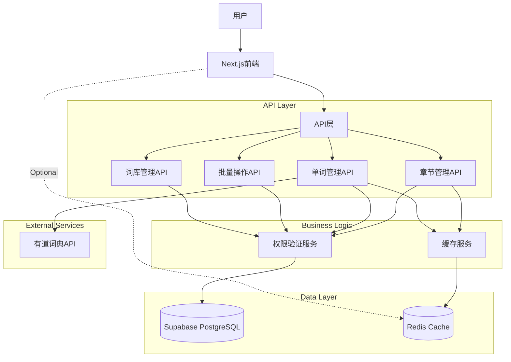
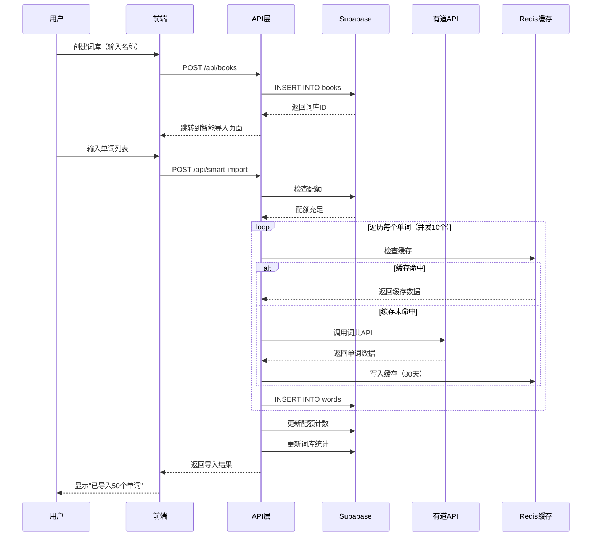
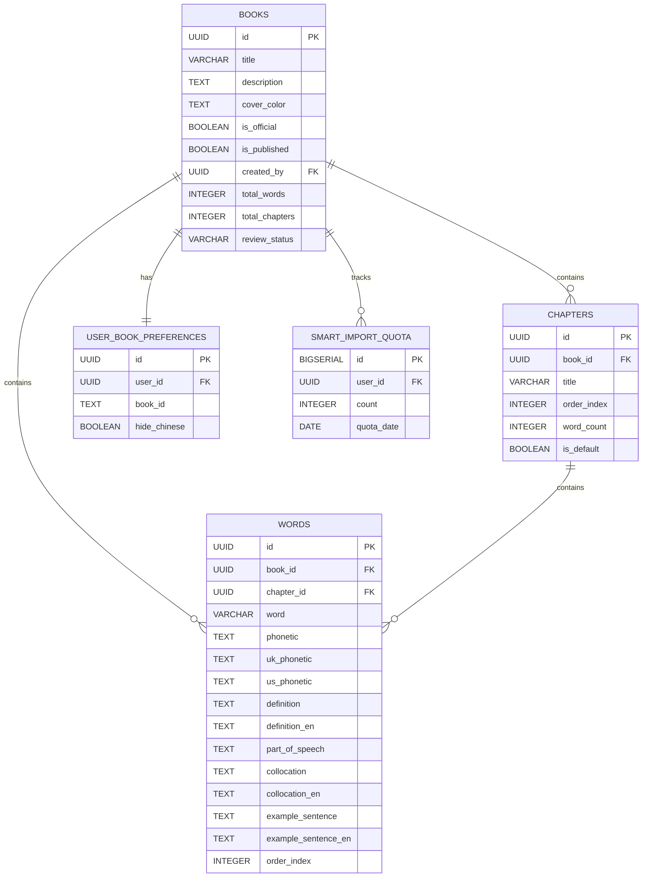

# 自定义词库管理功能 - 技术详细设计文档

> **文档版本**：v1.0
> **最后更新**：2026-01-15
> **项目名称**：小语笔记-英语（Web端）
> **适用范围**：PRD 第 7 节（自定义词库管理）

---

## 1. 需求概述

### 1.1 背景

当前平台的词库管理功能仅支持官方词库，用户无法创建个性化词库。为了满足用户自定义学习内容的需求，需要开发完整的自定义词库管理功能，包括词库创建、章节管理、智能导入、表格编辑、批量操作等核心能力。

### 1.2 核心流程

**一句话描述**：用户创建自定义词库 → 智能导入单词 → 章节分类管理 → 表格编辑完善 → 批量操作调整 → 多模式学习

### 1.3 范围边界

#### ✅ 本期包含
- 创建自定义词库（名称、描述、封面）
- 章节管理（CRUD、排序）
- 智能导入单词（调用有道API，每日500词配额）
- 表格编辑视图（Inline编辑单词字段）
- 批量操作（批量删除、批量移动章节）
- 批量添加单词（复用智能导入）
- 软删除词库（3次确认）

#### ❌ 本期不包含
- 多人协作编辑
- 词库分享/导出
- 版本控制
- 高级搜索功能

---

## 2. 总体设计

### 2.1 技术栈

| 类别 | 技术选型 | 版本 |
|------|---------|------|
| **前端框架** | Next.js | 16.1.1 (App Router) |
| **UI框架** | React | 19.2.3 |
| **开发语言** | TypeScript | 5.x |
| **样式方案** | Tailwind CSS | 4.x |
| **数据库** | Supabase (PostgreSQL) | 15+ |
| **认证** | Supabase Auth | - |
| **状态管理** | React Server Components | - |
| **API规范** | RESTful | - |

### 2.2 系统架构图



### 2.3 核心交互流程

#### 场景：创建词库并智能导入单词



---

## 3. 数据模型设计

### 3.1 ER 图 / 关系描述



#### 核心关系说明

1. **books ↔ chapters**：一对多（一个词库包含多个章节）
2. **chapters ↔ words**：一对多（一个章节包含多个单词，支持无章节模式）
3. **books ↔ user_book_preferences**：一对一（每个用户对每本书有一条偏好记录）
4. **books ↔ smart_import_quota**：一对多（每个用户每天有一条配额记录）

### 3.2 数据库变更（DDL）

> **设计决策**：经 Code Review 确认，现有表结构完全满足需求，**无需新建表**，仅需新增3个复合索引以优化性能。

#### 3.2.1 新增索引（性能优化）

```sql
-- ============================================
-- 自定义词库管理功能 - 索引优化
-- 创建时间：2026-01-15
-- 目的：优化章节管理、批量操作查询性能
-- ============================================

-- 1. 章节表复合索引（词库 + 排序）
-- 查询场景：获取某词库的所有章节并按 order_index 排序
-- 设计理由：
--   - 表格编辑视图需要频繁查询章节列表
--   - 章节管理需要按 order_index 排序
--   - 复合索引能避免 filesort，提升查询性能
DROP INDEX IF EXISTS idx_chapters_book_order;
CREATE INDEX idx_chapters_book_order
  ON chapters(book_id, order_index DESC);

-- 2. 单词表复合索引（章节 + 排序）
-- 查询场景：获取某章节的所有单词并按 order_index 排序
-- 设计理由：
--   - 表格视图分页查询（按章节筛选）
--   - 批量移动单词需要查询章节下的单词
--   - 复合索引直接利用索引顺序，避免额外排序
DROP INDEX IF EXISTS idx_words_chapter_order;
CREATE INDEX idx_words_chapter_order
  ON words(chapter_id, order_index ASC);

-- 3. 单词表复合索引（词库 + 单词）
-- 查询场景：批量操作时按 book_id 和 word 筛选
-- 设计理由：
--   - 批量删除时需要验证单词权限
--   - 批量移动时需要检查单词是否存在
--   - 避免全表扫描，显著提升批量操作性能
DROP INDEX IF EXISTS idx_words_book_word;
CREATE INDEX idx_words_book_word
  ON words(book_id, word);

-- ============================================
-- 索引使用验证
-- ============================================

-- 验证索引1：章节列表查询
EXPLAIN ANALYZE
SELECT * FROM chapters
WHERE book_id = 'book-uuid'
ORDER BY order_index DESC;
-- 预期：使用 idx_chapters_book_order 索引

-- 验证索引2：单词列表查询（按章节）
EXPLAIN ANALYZE
SELECT * FROM words
WHERE chapter_id = 'chapter-uuid'
ORDER BY order_index ASC
LIMIT 50;
-- 预期：使用 idx_words_chapter_order 索引

-- 验证索引3：批量操作权限检查
EXPLAIN ANALYZE
SELECT book_id, word FROM words
WHERE book_id = 'book-uuid' AND id IN ('word-1', 'word-2');
-- 预期：使用 idx_words_book_word 索引
```

#### 3.2.2 现有表结构（无需修改）

```sql
-- ============================================
-- books 表（词库主表）
-- ============================================
CREATE TABLE IF NOT EXISTS books (
  id UUID PRIMARY KEY DEFAULT gen_random_uuid(),

  -- 基础信息
  title VARCHAR(255) NOT NULL,                    -- 词库标题
  description TEXT,                                -- 词库描述
  cover_color TEXT DEFAULT 'from-green-400 to-green-500',  -- 封面渐变色
  cover_url TEXT,                                  -- AI生成的封面图片URL

  -- 分类与状态
  category VARCHAR(50) NOT NULL,                   -- 'custom' | 'exam' | 'scenario' | 'textbook'
  is_official BOOLEAN DEFAULT false,               -- 是否官方词库
  is_published BOOLEAN DEFAULT true,               -- 软删除开关

  -- 创建者信息
  created_by UUID REFERENCES auth.users(id) ON DELETE SET NULL,

  -- 统计字段
  total_words INTEGER DEFAULT 0,                   -- 总单词数
  total_chapters INTEGER DEFAULT 0,                -- 总章节数

  -- 审核字段（自定义词库需审核）
  review_status VARCHAR(20) DEFAULT 'pending'
    CHECK (review_status IN ('pending', 'approved', 'rejected')),
  review_reason TEXT,                              -- 审核意见
  reviewed_by UUID REFERENCES auth.users(id),
  reviewed_at TIMESTAMP WITH TIME ZONE,

  -- 时间戳
  created_at TIMESTAMP WITH TIME ZONE DEFAULT NOW(),
  updated_at TIMESTAMP WITH TIME ZONE DEFAULT NOW()
);

-- ============================================
-- chapters 表（章节表）
-- ============================================
CREATE TABLE IF NOT EXISTS chapters (
  id UUID PRIMARY KEY DEFAULT gen_random_uuid(),
  book_id UUID NOT NULL REFERENCES books(id) ON DELETE CASCADE,
  title VARCHAR(255) NOT NULL,                    -- 章节标题
  order_index INTEGER NOT NULL,                   -- 排序索引
  word_count INTEGER DEFAULT 0,                   -- 单词数量
  is_default BOOLEAN DEFAULT false,               -- 是否默认章节
  created_at TIMESTAMP WITH TIME ZONE DEFAULT NOW()
);

-- ============================================
-- words 表（单词表）
-- ============================================
CREATE TABLE IF NOT EXISTS words (
  id UUID PRIMARY KEY DEFAULT gen_random_uuid(),
  chapter_id UUID REFERENCES chapters(id) ON DELETE SET NULL,  -- 可为NULL（无章节模式）
  book_id UUID NOT NULL REFERENCES books(id) ON DELETE CASCADE,

  -- 单词基础信息
  word VARCHAR(255) NOT NULL,
  phonetic TEXT,                                  -- 旧字段（保留兼容）
  uk_phonetic TEXT,                               -- 英式音标
  us_phonetic TEXT,                               -- 美式音标

  -- 释义与例句
  definition TEXT NOT NULL,                       -- 中文释义
  definition_en TEXT,                             -- 英文释义
  collocation TEXT,                               -- 搭配（中文）
  collocation_en TEXT,                            -- 搭配（英文）
  example_sentence TEXT,                          -- 例句（中文）
  example_sentence_en TEXT,                       -- 例句（英文）

  -- 词性与属性
  part_of_speech TEXT,                            -- 词性
  audio_url TEXT,
  image_url TEXT,
  difficulty_score INTEGER,
  frequency_rank INTEGER,

  -- 排序与时间
  order_index INTEGER NOT NULL,
  created_at TIMESTAMP WITH TIME ZONE DEFAULT NOW(),
  updated_at TIMESTAMP WITH TIME ZONE DEFAULT NOW()
);

-- ============================================
-- smart_import_quota 表（智能导入配额表）
-- ============================================
CREATE TABLE IF NOT EXISTS smart_import_quota (
  id BIGSERIAL PRIMARY KEY,
  user_id UUID NOT NULL REFERENCES auth.users(id) ON DELETE CASCADE,
  count INTEGER NOT NULL DEFAULT 0,              -- 当日已使用次数
  quota_date DATE NOT NULL DEFAULT CURRENT_DATE,
  created_at TIMESTAMP WITH TIME ZONE DEFAULT NOW(),
  updated_at TIMESTAMP WITH TIME ZONE DEFAULT NOW()
);

-- 唯一索引：每个用户每天只有一条记录
CREATE UNIQUE INDEX smart_import_quota_user_date_idx
  ON smart_import_quota(user_id, quota_date);
```

---

## 4. 接口设计

### 4.1 章节管理 API

#### 接口1：获取章节列表

```
[GET] /api/books/{bookId}/chapters

鉴权：✅ 需要登录（仅词库创建者）

关键入参：
  - bookId: string (UUID) - 路径参数
  - includeWordCount: boolean (可选) - 是否包含单词统计

关键出参：
{
  "success": true,
  "data": [
    {
      "id": "uuid",
      "title": "第1章 基础词汇",
      "order_index": 1,
      "word_count": 50,
      "is_default": false
    }
  ]
}

逻辑摘要：
  1. 验证用户登录
  2. 查询词库权限（仅创建者可查看）
  3. 查询章节列表（按 order_index 排序）
  4. 可选：统计每个章节的单词数
```

#### 接口2：创建章节

```
[POST] /api/books/{bookId}/chapters

鉴权：✅ 需要登录（仅词库创建者）

关键入参：
{
  "title": "第1章 基础词汇",  // 必填，1-50字符
  "order_index": 1            // 可选，不填自动设置为最后
}

关键出参：
{
  "success": true,
  "data": {
    "id": "uuid",
    "title": "第1章 基础词汇",
    "order_index": 1,
    "book_id": "uuid"
  }
}

逻辑摘要：
  1. 验证用户登录和词库权限
  2. 校验标题（非空、长度、唯一性）
  3. 计算 order_index（自动或手动）
  4. 插入章节并更新词库统计
```

#### 接口3：删除章节

```
[DELETE] /api/books/{bookId}/chapters/{chapterId}

鉴权：✅ 需要登录（仅词库创建者）

关键入参：
  - bookId: string (UUID) - 路径参数
  - chapterId: string (UUID) - 路径参数

关键出参：
{
  "success": true,
  "message": "章节已删除，30个单词已移到默认章节",
  "data": {
    "movedWords": 30
  }
}

逻辑摘要：
  1. 验证用户登录和权限
  2. 检查是否为默认章节（不允许删除）
  3. 将章节的单词移到默认章节
  4. 删除章节并重新排序剩余章节
```

---

### 4.2 单词管理 API（表格编辑视图）

#### 接口4：获取单词列表

```
[GET] /api/books/{bookId}/words

鉴权：✅ 需要登录（仅词库创建者）

关键入参：
  - bookId: string (UUID) - 路径参数
  - page: number (可选，默认1)
  - pageSize: number (可选，默认50，最大100)
  - chapterId: string (可选) - 按章节筛选
  - search: string (可选) - 搜索单词
  - sortBy: string (可选，默认order_index)
  - sortOrder: 'asc' | 'desc' (可选，默认asc)

关键出参：
{
  "success": true,
  "data": [
    {
      "id": "uuid",
      "chapter_id": "uuid",
      "word": "agenda",
      "phonetic": "/əˈdʒendə/",
      "uk_phonetic": "/əˈdʒendə/",
      "us_phonetic": "/əˈdʒendə/",
      "part_of_speech": "n",
      "definition": "议程，日程表",
      "order_index": 1
    }
  ],
  "pagination": {
    "page": 1,
    "pageSize": 50,
    "total": 100,
    "totalPages": 2
  }
}

逻辑摘要：
  1. 验证用户登录和词库权限
  2. 构建查询条件（分页、筛选、搜索）
  3. 查询单词列表并附加学习状态
  4. 返回分页信息
```

#### 接口5：更新单词字段（Inline编辑）

```
[PUT] /api/words/{wordId}

鉴权：✅ 需要登录（仅词库创建者）

关键入参：
{
  "word": "agenda",              // 可选
  "chapter_id": "uuid",          // 可选（支持移动章节）
  "definition": "议程，日程表",  // 可选
  "part_of_speech": "n",         // 可选
  "order_index": 1               // 可选
}

关键出参：
{
  "success": true,
  "data": {
    "id": "uuid",
    "word": "agenda",
    "definition": "议程，日程表"
  }
}

逻辑摘要：
  1. 验证用户登录和词库权限
  2. 校验必填字段（word、definition 不能为空）
  3. 更新单词字段（不调用第三方API）
  4. 更新相关统计（章节词数、词库词数）
```

---

### 4.3 批量操作 API

#### 接口6：批量删除单词

```
[POST] /api/words/batch-delete

鉴权：✅ 需要登录（仅词库创建者）

关键入参：
{
  "wordIds": ["uuid-1", "uuid-2", "uuid-3"]  // 最多100个
}

关键出参：
{
  "success": true,
  "data": {
    "deleted": 30,
    "failed": 0,
    "errors": []
  }
}

逻辑摘要：
  1. 验证用户登录和词库权限
  2. 批量删除单词（支持部分成功）
  3. 异步更新词库统计
  4. 返回成功/失败详情
```

#### 接口7：批量移动单词

```
[POST] /api/words/batch-move

鉴权：✅ 需要登录（仅词库创建者）

关键入参：
{
  "wordIds": ["uuid-1", "uuid-2"],
  "targetChapterId": "uuid"  // null表示移到默认章节
}

关键出参：
{
  "success": true,
  "data": {
    "moved": 50,
    "message": "已移动50个单词到「第1章 基础词汇」"
  }
}

逻辑摘要：
  1. 验证用户登录和词库权限
  2. 验证目标章节存在性
  3. 事务性批量更新（全成功或全失败）
  4. 更新原章节和目标章节的词数统计
```

---

### 4.4 词库管理 API

#### 接口8：软删除词库

```
[DELETE] /api/books/{bookId}

鉴权：✅ 需要登录（仅词库创建者）

关键入参：
{
  "confirmed": true,           // 是否确认删除
  "confirmation_step": 3        // 确认步骤（需到第3步）
}

关键出参：
{
  "success": true,
  "message": "词库已删除"
}

逻辑摘要：
  1. 验证用户登录和词库权限
  2. 检查确认步骤（需完成3次确认）
  3. 软删除（设置 is_published=false）
  4. 记录操作日志
```

---

## 5. 核心业务逻辑

### 5.1 场景A：创建章节（带自动排序）

#### 事务策略
- **事务边界**：整个创建过程（包括 order_index 调整）
- **隔离级别**：READ COMMITTED
- **锁策略**：行锁（FOR UPDATE on chapters）

#### 缓存策略
- **类型**：Cache-Aside（读时绕过，写时失效）
- **失效时机**：创建成功后删除 `book:chapters:{bookId}` 缓存
- **TTL**：章节列表缓存30分钟

#### 伪代码实现

```typescript
/**
 * 创建章节（自动计算排序）
 */
async function createChapter(bookId: string, params: CreateChapterParams) {
  // ===== 步骤1：权限检查 =====
  const user = await requireAuth()
  const book = await checkBookPermission(user.id, bookId, true)

  if (book.is_official === true) {
    throw new ForbiddenError('官方词库不支持章节管理')
  }

  // ===== 步骤2：参数验证 =====
  if (!params.title || params.title.trim().length === 0) {
    throw new BadRequestError('章节标题不能为空')
  }

  if (params.title.length > 50) {
    throw new BadRequestError('章节标题不能超过50个字符')
  }

  // ===== 步骤3：开启事务 =====
  const client = await getPgClient()

  try {
    await client.query('BEGIN')

    // ===== 步骤4：检查标题重复（加锁防止并发） =====
    const { rows: existing } = await client.query(
      `SELECT id FROM chapters
       WHERE book_id = $1 AND title = $2
       FOR UPDATE`,  -- 行锁
      [bookId, params.title.trim()]
    )

    if (existing.length > 0) {
      await client.query('ROLLBACK')
      throw new BadRequestError('章节标题已存在')
    }

    // ===== 步骤5：自动计算 order_index =====
    let orderIndex = params.order_index

    if (orderIndex === undefined) {
      // 自动设置为最后一个
      const { rows: [{ next_order }] } = await client.query(
        `SELECT COALESCE(MAX(order_index), 0) + 1 as next_order
         FROM chapters
         WHERE book_id = $1`,
        [bookId]
      )
      orderIndex = next_order
    } else {
      // 手动指定：调整其他章节的顺序
      await client.query(
        `UPDATE chapters
         SET order_index = order_index + 1
         WHERE book_id = $1 AND order_index >= $2`,
        [bookId, orderIndex]
      )
    }

    // ===== 步骤6：插入章节 =====
    const { rows: [newChapter] } = await client.query(
      `INSERT INTO chapters (id, book_id, title, order_index, word_count, is_default)
       VALUES (gen_random_uuid(), $1, $2, $3, 0, false)
       RETURNING *`,
      [bookId, params.title.trim(), orderIndex]
    )

    // ===== 步骤7：更新词库统计 =====
    await client.query(
      `UPDATE books
       SET total_chapters = total_chapters + 1,
           updated_at = NOW()
       WHERE id = $1`,
      [bookId]
    )

    // ===== 步骤8：提交事务 =====
    await client.query('COMMIT')

    // ===== 步骤9：失效缓存 =====
    await redis.del(`book:chapters:${bookId}`)

    return {
      success: true,
      data: newChapter
    }

  } catch (error) {
    await client.query('ROLLBACK')
    throw error
  }
}
```

#### 流程图

```mermaid
flowchart TD
    Start([开始]) --> Auth[验证用户登录]
    Auth --> CheckPerm[检查词库权限]
    CheckPerm --> Validate{参数验证}
    Validate -->|失败| Err1[返回错误]
    Validate -->|成功| Begin[开启事务]

    Begin --> Lock[检查标题重复<br/>加行锁]
    Lock --> Duplicate{是否重复?}
    Duplicate -->|是| Rollback1[回滚事务]
    Rollback1 --> Err2[返回"标题已存在"]

    Duplicate -->|否| CalcOrder{是否指定排序?}
    CalcOrder -->|否| AutoOrder[自动设置为最后一个]
    CalcOrder -->|是| AdjustOrder[调整其他章节顺序]

    AutoOrder --> Insert[插入章节]
    AdjustOrder --> Insert

    Insert --> UpdateStats[更新词库统计]
    UpdateStats --> Commit[提交事务]

    Commit --> Invalidate[失效缓存]
    Invalidate --> Success([返回章节对象])

    Err1 --> End([结束])
    Err2 --> End
    Success --> End
```

---

### 5.2 场景B：批量移动单词

#### 事务策略
- **事务边界**：整个移动过程
- **隔离级别**：SERIALIZABLE（防止并发修改导致数据不一致）
- **锁策略**：行锁（words + chapters）

#### 缓存策略
- **类型**：Write-Through（写时更新缓存）
- **失效时机**：移动成功后删除相关缓存
- **缓存键**：
  - `book:words:{bookId}:*`
  - `chapter:words:{chapterId}:*`

#### 伪代码实现

```typescript
/**
 * 批量移动单词到指定章节
 * 全成功或全失败（事务性）
 */
async function batchMoveWords(
  wordIds: string[],
  targetChapterId: string | null
) {
  // ===== 步骤1：基础验证 =====
  const user = await requireAuth()

  if (wordIds.length > 100) {
    throw new BadRequestError('每次最多移动100个单词')
  }

  // ===== 步骤2：查询单词和词库信息 =====
  const { data: words, error } = await supabase
    .from('words')
    .select('id, book_id, chapter_id')
    .in('id', wordIds)

  if (error || !words || words.length === 0) {
    throw new NotFoundError('单词不存在')
  }

  // 检查所有单词是否属于同一词库
  const bookIds = [...new Set(words.map(w => w.book_id))]
  if (bookIds.length > 1) {
    throw new BadRequestError('所有单词必须属于同一词库')
  }

  const bookId = bookIds[0]

  // ===== 步骤3：权限验证 =====
  const book = await checkBookPermission(user.id, bookId, true)

  // ===== 步骤4：验证目标章节 =====
  if (targetChapterId !== null) {
    const { data: targetChapter } = await supabase
      .from('chapters')
      .select('id, book_id')
      .eq('id', targetChapterId)
      .single()

    if (!targetChapter || targetChapter.book_id !== bookId) {
      throw new NotFoundError('目标章节不存在')
    }
  }

  // ===== 步骤5：开启事务（SERIALIZABLE隔离级别） =====
  const client = await getPgClient()

  try {
    await client.query('BEGIN TRANSACTION ISOLATION LEVEL SERIALIZABLE')

    // ===== 步骤6：批量更新单词的章节 =====
    const { rowCount } = await client.query(
      `UPDATE words
       SET chapter_id = $1, updated_at = NOW()
       WHERE id = ANY($2::uuid[])
       RETURNING id, chapter_id`,
      [targetChapterId, wordIds]
    )

    if (rowCount === 0) {
      await client.query('ROLLBACK')
      throw new BadRequestError('没有单词被更新')
    }

    // ===== 步骤7：更新章节的单词计数 =====

    // 收集原章节ID（需要减少计数）
    const sourceChapterIds = [...new Set(
      words
        .map(w => w.chapter_id)
        .filter(id => id !== null)
    )]

    // 更新所有受影响章节的计数
    const affectedChapterIds = [...sourceChapterIds]
    if (targetChapterId !== null) {
      affectedChapterIds.push(targetChapterId)
    }

    for (const chapterId of affectedChapterIds) {
      await client.query(
        `UPDATE chapters
         SET word_count = (
           SELECT COUNT(*)
           FROM words
           WHERE chapter_id = $1
         )
         WHERE id = $1`,
        [chapterId]
      )
    }

    // ===== 步骤8：提交事务 =====
    await client.query('COMMIT')

    // ===== 步骤9：失效所有相关缓存 =====
    const pipeline = redis.pipeline()
    pipeline.del(`book:words:${bookId}`)
    pipeline.del(`book:chapters:${bookId}`)

    for (const chapterId of affectedChapterIds) {
      pipeline.del(`chapter:words:${chapterId}`)
    }

    await pipeline.exec()

    // ===== 步骤10：返回结果 =====
    let targetChapterTitle = '默认章节'
    if (targetChapterId !== null) {
      const { data: chapter } = await supabase
        .from('chapters')
        .select('title')
        .eq('id', targetChapterId)
        .single()
      targetChapterTitle = chapter?.title || '默认章节'
    }

    return {
      success: true,
      data: {
        moved: rowCount,
        message: `已移动${rowCount}个单词到「${targetChapterTitle}」`
      }
    }

  } catch (error) {
    await client.query('ROLLBACK')
    throw error
  }
}
```

#### 流程图

```mermaid
flowchart TD
    Start([开始]) --> Auth[验证用户登录]
    Auth --> ValidateCount{检查数量}
    ValidateCount -->|>100| Err1[返回错误]
    ValidateCount -->|≤100| QueryWords[查询单词信息]

    QueryWords --> CheckSameBook{是否同一词库?}
    CheckSameBook -->|否| Err2[返回错误]
    CheckSameBook -->|是| CheckPerm[验证词库权限]

    CheckPerm --> ValidateTarget{目标章节有效?}
    ValidateTarget -->|否| Err3[返回"章节不存在"]
    ValidateTarget -->|是| Begin[开启事务<br/>SERIALIZABLE]

    Begin --> UpdateWords[批量更新单词章节]
    UpdateWords --> CheckUpdate{更新成功?}
    CheckUpdate -->|否| Rollback1[回滚事务]
    Rollback1 --> Err4[返回"更新失败"]

    CheckUpdate -->|是| GetChapters[获取受影响的章节ID]
    GetChapters --> Loop{遍历每个章节}

    Loop --> UpdateStats[更新章节单词计数]
    UpdateStats --> Loop

    Loop -->|完成| Commit[提交事务]
    Commit --> Invalidate[失效所有缓存]
    Invalidate --> Success([返回成功结果])

    Err1 --> End([结束])
    Err2 --> End
    Err3 --> End
    Err4 --> End
    Success --> End
```

---

### 5.3 场景C：智能导入单词

#### 事务策略
- **事务边界**：每个单词独立事务（支持部分成功）
- **隔离级别**：READ COMMITTED
- **锁策略**：无锁（依赖数据库唯一约束）

#### 缓存策略
- **类型**：Write-Through（写时穿透）
- **TTL**：30天（单词数据基本不变）
- **缓存键**：`word:data:{word}`（小写）

#### 依赖服务
- **有道词典API**：https://dict.youdao.com/jsonapi

#### 伪代码实现

```typescript
/**
 * 智能导入单词（调用有道API）
 * 并发控制：10个请求/秒
 * 配额限制：500词/天
 */
async function smartImportWords(bookId: string, wordList: string[]) {
  const user = await requireAuth()

  // ===== 步骤1：配额检查 =====
  const { data: quota } = await supabase
    .from('smart_import_quota')
    .select('count, quota_date')
    .eq('user_id', user.id)
    .eq('quota_date', new Date().toISOString().split('T')[0])
    .single()

  const usedCount = quota?.count || 0
  const remaining = 500 - usedCount

  if (remaining <= 0) {
    throw new QuotaExceededError('今日配额已用完，请明天再试')
  }

  if (wordList.length > remaining) {
    throw new QuotaExceededError(`超出配额，今日剩余${remaining}词`)
  }

  // ===== 步骤2：权限验证 =====
  const book = await checkBookPermission(user.id, bookId, true)

  // ===== 步骤3：并发控制（分批次） =====
  const chunks = chunk(wordList, 10)  // 每批10个并发
  const results = []
  const cache = await getRedisClient()

  for (const chunk of chunks) {
    const promises = chunk.map(async (word) => {
      const trimmedWord = word.trim().toLowerCase()

      // ===== 步骤3.1：检查缓存 =====
      const cacheKey = `word:data:${trimmedWord}`
      const cached = await cache.get(cacheKey)

      if (cached) {
        return JSON.parse(cached)
      }

      // ===== 步骤3.2：调用有道API =====
      try {
        const data = await fetchYoudaoAPI(trimmedWord)

        // ===== 步骤3.3：写入缓存 =====
        await cache.setex(
          cacheKey,
          30 * 24 * 3600,  // 30天
          JSON.stringify(data)
        )

        return data
      } catch (error) {
        console.error(`Failed to fetch word "${trimmedWord}":`, error)
        return null  // 跳过失败的单词
      }
    })

    const chunkResults = await Promise.allSettled(promises)
    results.push(...chunkResults)
  }

  // ===== 步骤4：过滤失败的单词 =====
  const validWords = results
    .filter(r => r.status === 'fulfilled' && r.value !== null)
    .map(r => r.value)

  if (validWords.length === 0) {
    throw new InternalServerError('没有成功获取任何单词数据')
  }

  // ===== 步骤5：查找或创建默认章节 =====
  let defaultChapterId

  const { data: existingChapter } = await supabase
    .from('chapters')
    .select('id')
    .eq('book_id', bookId)
    .eq('is_default', true)
    .single()

  if (existingChapter) {
    defaultChapterId = existingChapter.id
  } else {
    const { data: newChapter } = await supabase
      .from('chapters')
      .insert({
        book_id: bookId,
        title: '默认章节',
        order_index: 0,
        is_default: true,
        word_count: 0
      })
      .select()
      .single()

    defaultChapterId = newChapter.id
  }

  // ===== 步骤6：批量插入单词 =====
  const wordsToInsert = validWords.map((wordData, index) => ({
    book_id: bookId,
    chapter_id: defaultChapterId,
    word: wordData.word,
    phonetic: wordData.phonetic || '',
    uk_phonetic: wordData.uk_phonetic || '',
    us_phonetic: wordData.us_phonetic || '',
    definition: wordData.definition,
    definition_en: wordData.definition_en || '',
    part_of_speech: wordData.part_of_speech || '',
    collocation: wordData.collocation || '',
    collocation_en: wordData.collocation_en || '',
    example_sentence: wordData.example_sentence || '',
    example_sentence_en: wordData.example_sentence_en || '',
    order_index: index + 1
  }))

  const { data: insertedWords, error: insertError } = await supabase
    .from('words')
    .insert(wordsToInsert)
    .select()

  if (insertError) {
    throw new InternalServerError('插入单词失败')
  }

  // ===== 步骤7：更新配额计数 =====
  await supabase
    .from('smart_import_quota')
    .upsert({
      user_id: user.id,
      count: usedCount + validWords.length,
      quota_date: new Date().toISOString().split('T')[0]
    })

  // ===== 步骤8：更新词库统计 =====
  await supabase
    .from('books')
    .update({
      total_words: book.total_words + validWords.length,
      updated_at: new Date().toISOString()
    })
    .eq('id', bookId)

  await supabase
    .from('chapters')
    .update({
      word_count: existingChapter?.word_count + validWords.length || validWords.length
    })
    .eq('id', defaultChapterId)

  // ===== 步骤9：失效缓存 =====
  await redis.del(`book:words:${bookId}`)
  await redis.del(`book:chapters:${bookId}`)

  return {
    success: true,
    data: {
      words: insertedWords,
      imported: insertedWords.length,
      remaining: 500 - (usedCount + insertedWords.length)
    }
  }
}

/**
 * 调用有道API（带重试）
 */
async function fetchYoudaoAPI(word: string, maxRetries = 3): Promise<any> {
  for (let attempt = 0; attempt < maxRetries; attempt++) {
    try {
      const response = await fetch(
        `https://dict.youdao.com/jsonapi?q=${encodeURIComponent(word)}&type=1`,
        {
          timeout: 5000,
          headers: {
            'User-Agent': 'Mozilla/5.0 (Compatible; MyEduPlatform/1.0)'
          }
        }
      )

      if (response.status === 429) {
        // 指数退避重试
        const delay = Math.pow(2, attempt) * 1000
        await sleep(delay)
        continue
      }

      if (!response.ok) {
        throw new Error(`API error: ${response.status}`)
      }

      const data = await response.json()
      return parseYoudaoResponse(data, word)

    } catch (error) {
      if (attempt === maxRetries - 1) {
        throw error
      }
    }
  }
}

/**
 * 解析有道API响应
 */
function parseYoudaoResponse(response: any, word: string) {
  const basic = response.basic || {}
  const web = response.web || []

  return {
    word,
    phonetic: basic.phonetic || '',
    uk_phonetic: basic['uk-phonetic'] || '',
    us_phonetic: basic['us-phonetic'] || '',
    definition: basic.explains?.join('\n') || '',
    part_of_speech: extractPartOfSpeech(basic.explains),
    collocation: web[0]?.key || '',
    collocation_en: web[0]?.value?.[0] || '',
    example_sentence: '',
    example_sentence_en: ''
  }
}
```

#### 流程图

```mermaid
flowchart TD
    Start([开始]) --> Auth[验证用户登录]
    Auth --> CheckQuota[检查今日配额]

    CheckQuota --> HasQuota{配额充足?}
    HasQuota -->|否| Err1[返回"配额已用完"]
    HasQuota -->|是| CheckPerm[验证词库权限]

    CheckPerm --> Split[分批处理<br/>每批10个并发]
    Split --> Loop{遍历每批}

    Loop --> CheckCache{检查缓存}
    CheckCache -->|命中| ReturnCached[返回缓存数据]
    CheckCache -->|未命中| FetchAPI[调用有道API]

    FetchAPI --> APIError{API成功?}
    APIError -->|429限流| Retry[指数退避重试]
    Retry --> FetchAPI
    APIError -->|其他错误| SkipWord[跳过该单词]
    APIError -->|成功| ParseData[解析API响应]

    ParseData --> WriteCache[写入缓存30天]
    ReturnCached --> Collect
    WriteCache --> Collect[收集结果]
    SkipWord --> Collect

    Collect --> Loop

    Loop -->|完成| FilterValid{有有效数据?}
    FilterValid -->|否| Err2[返回"获取失败"]
    FilterValid -->|是| CheckChapter{默认章节存在?}

    CheckChapter -->|否| CreateChapter[创建默认章节]
    CheckChapter -->|是| InsertWords
    CreateChapter --> InsertWords[批量插入单词]

    InsertWords --> UpdateQuota[更新配额计数]
    UpdateQuota --> UpdateStats[更新词库统计]
    UpdateStats --> Invalidate[失效缓存]
    Invalidate --> Success([返回导入结果])

    Err1 --> End([结束])
    Err2 --> End
    Success --> End
```

---

## 6. 非功能性设计

### 6.1 安全性

#### 6.1.1 鉴权机制

| 安全层级 | 实现方式 | 保护内容 |
|---------|---------|---------|
| **L1 用户认证** | Supabase Auth JWT | 验证用户身份 |
| **L2 权限验证** | 应用层权限检查 | 确保只有创建者能管理 |
| **L3 RLS策略** | PostgreSQL Row Level Security | 数据库层访问控制 |

```typescript
/**
 * 三层鉴权实现
 */
async function threeLayerAuth(bookId: string) {
  // L1: 用户认证
  const user = await requireAuth()

  // L2: 权限验证（应用层）
  const book = await checkBookPermission(user.id, bookId, true)

  // L3: RLS策略（数据库层自动生效）
  // Supabase会自动注入 user.id 到查询上下文
  const { data } = await supabase
    .from('words')
    .select('*')
    .eq('book_id', bookId)
  // RLS策略会自动过滤：只返回用户有权限的数据
}
```

#### 6.1.2 输入验证

```typescript
// 使用 Zod 进行严格输入验证
import { z } from 'zod'

const createChapterSchema = z.object({
  title: z.string()
    .min(1, '标题不能为空')
    .max(50, '标题不能超过50字符')
    .regex(/^[\u4e00-\u9fa5a-zA-Z0-9\s]+$/, '标题包含非法字符'),
  order_index: z.number()
    .int('必须是整数')
    .positive('必须大于0')
    .optional()
})

const updateWordSchema = z.object({
  word: z.string().min(1).max(255).optional(),
  chapter_id: z.string().uuid().nullable().optional(),
  definition: z.string().max(1000).optional(),
  // ... 其他字段
})

// 使用示例
const validated = createChapterSchema.parse(rawInput)
```

#### 6.1.3 SQL注入防护

```typescript
// ✅ 正确：使用参数化查询
await supabase
  .from('chapters')
  .select('*')
  .eq('title', userInput)  // 自动转义

// ❌ 错误：字符串拼接（易受注入攻击）
const query = `SELECT * FROM chapters WHERE title = '${userInput}'`
```

#### 6.1.4 敏感数据脱敏

```typescript
// 审计日志脱敏
await auditLog({
  user_id: user.id,
  action: 'delete_book',
  resource_id: bookId,
  details: {
    total_words: book.total_words,
    // 不记录敏感字段（如用户IP）
    ip_hash: hashIP(clientIP)  // 存储哈希值而非原文
  }
})
```

---

### 6.2 性能优化

#### 6.2.1 索引策略

| 索引名称 | 字段 | 类型 | 查询场景 |
|---------|------|------|---------|
| `idx_chapters_book_order` | (book_id, order_index DESC) | 复合索引 | 章节列表查询 |
| `idx_words_chapter_order` | (chapter_id, order_index ASC) | 复合索引 | 单词列表分页 |
| `idx_words_book_word` | (book_id, word) | 复合索引 | 批量操作权限检查 |

#### 6.2.2 缓存策略

```yaml
缓存层: Redis
缓存策略:
  - Cache-Aside: 读时绕过，写时失效
  - Write-Through: 写时穿透更新

缓存场景:
  1. 单词数据（有道API响应）
     Key: word:data:{word}
     TTL: 30天
     理由: 单词释义基本不变，长期缓存可减少API调用

  2. 章节列表
     Key: book:chapters:{bookId}
     TTL: 30分钟
     理由: 章节不常变化，中等时长缓存

  3. 单词列表（分页）
     Key: book:words:{bookId}:{page}:{filters_hash}
     TTL: 5分钟
     理由: 学习状态频繁变化，短缓存保证一致性

缓存更新策略:
  - 创建/更新/删除：主动失效相关缓存
  - 查询：先查缓存，未命中再查DB
```

#### 6.2.3 批量操作优化

```typescript
// ✅ 优化：使用数组操作（单次SQL）
await supabase
  .from('words')
  .delete()
  .in('id', wordIds)  // WHERE id IN (...)

// ❌ 避免：循环删除（N+1问题）
for (const wordId of wordIds) {
  await supabase.from('words').delete().eq('id', wordId)
}
```

#### 6.2.4 分页优化（游标分页）

```typescript
/**
 * 使用游标分页替代偏移分页
 * 适用于大数据量场景
 */
async function getWordsWithCursor(
  bookId: string,
  cursor: string | null,
  limit: number = 50
) {
  let query = supabase
    .from('words')
    .select('*')
    .eq('book_id', bookId)
    .order('order_index', { ascending: true })
    .limit(limit + 1)  // 多取1条判断是否有下一页

  if (cursor) {
    query = query.gt('order_index', cursor)
  }

  const { data, error } = await query

  const hasMore = data.length > limit
  const words = hasMore ? data.slice(0, limit) : data
  const nextCursor = hasMore ? words[words.length - 1].order_index : null

  return { data: words, nextCursor, hasMore }
}
```

---

### 6.3 异常处理

#### 6.3.1 重试机制（指数退避）

```typescript
/**
 * 通用重试装饰器
 * 用于外部API调用
 */
async function retryWithBackoff<T>(
  fn: () => Promise<T>,
  maxRetries: number = 3
): Promise<T> {
  for (let attempt = 0; attempt < maxRetries; attempt++) {
    try {
      return await fn()
    } catch (error) {
      if (attempt === maxRetries - 1) {
        throw error
      }

      // 指数退避：1s, 2s, 4s
      const delay = Math.pow(2, attempt) * 1000
      await sleep(delay)
    }
  }
  throw new Error('Max retries exceeded')
}

// 使用示例
const data = await retryWithBackoff(
  () => fetchYoudaoAPI(word),
  3  // 最多重试3次
)
```

#### 6.3.2 补偿机制（最终一致性）

```typescript
/**
 * 批量操作失败补偿
 * 使用后台任务重试
 */
async function batchDeleteWithCompensation(wordIds: string[]) {
  const results = await batchDeleteWords(wordIds)

  // 记录失败的单词
  const failedWordIds = results.errors
    .filter(e => e.reason !== 'not_found')
    .map(e => e.wordId)

  if (failedWordIds.length > 0) {
    // 加入重试队列（使用后台任务）
    await enqueueRetryJob({
      type: 'batch_delete_words',
      payload: { wordIds: failedWordIds },
      retryAt: new Date(Date.now() + 5 * 60 * 1000)  // 5分钟后重试
    })
  }

  return results
}
```

#### 6.3.3 错误码规范

```typescript
enum ErrorCode {
  // 认证相关 (401)
  UNAUTHORIZED = '40101',
  TOKEN_EXPIRED = '40102',

  // 权限相关 (403)
  FORBIDDEN = '40301',
  NOT_CREATOR = '40302',
  OFFICIAL_BOOK_READONLY = '40303',

  // 参数错误 (400)
  INVALID_PARAMS = '40001',
  TITLE_DUPLICATE = '40002',
  EXCEED_LIMIT = '40003',
  QUOTA_EXCEEDED = '42901',

  // 资源不存在 (404)
  BOOK_NOT_FOUND = '40401',
  CHAPTER_NOT_FOUND = '40402',
  WORD_NOT_FOUND = '40403',

  // 服务器错误 (500)
  DATABASE_ERROR = '50001',
  EXTERNAL_API_ERROR = '50002',
}

// 错误响应格式
interface ErrorResponse {
  error: string
  code: ErrorCode
  details?: any
  timestamp: string
}
```

---

## 7. 风险与待办

### 7.1 潜在风险

| 风险项 | 风险等级 | 影响 | 缓解措施 |
|-------|---------|------|---------|
| **有道API限流** | 🟡 中 | 智能导入失败 | 1. 指数退避重试<br/>2. Redis缓存（30天）<br/>3. 降级方案：提示用户手动输入 |
| **批量操作超时** | 🟡 中 | 数据库连接池耗尽 | 1. 限制批量大小（100个）<br/>2. 使用游标分页<br/>3. 异步后台处理 |
| **并发更新冲突** | 🟢 低 | 数据不一致 | 1. 事务隔离级别SERIALIZABLE<br/>2. 乐观锁（version字段）<br/>3. 行锁（FOR UPDATE） |
| **缓存穿透** | 🟢 低 | Redis压力增大 | 1. 布隆过滤器<br/>2. 空值缓存（短TTL） |
| **第三方API失效** | 🔴 高 | 智能导入不可用 | 1. 监控API可用性<br/>2. 备用API源（如其他词典）<br/>3. 手动输入兜底 |

---

### 7.2 后续迭代建议

#### Phase 2：高级功能（下一期）

1. **词库分享**
   - 生成分享链接
   - 设置访问权限（公开/密码/指定用户）
   - 分享统计（访问次数、收藏次数）

2. **词库导出**
   - 导出为Excel/CSV
   - 导出为PDF（带排版）
   - 导出为Anki卡片格式

3. **版本控制**
   - 记录每次修改历史
   - 支持回滚到历史版本
   - 显示修改diff

4. **多人协作**
   - 邀请协作者
   - 权限管理（编辑/查看）
   - 实时协作编辑

#### Phase 3：智能化（长期规划）

1. **AI辅助学习**
   - 根据遗忘曲线智能复习
   - 个性化学习路径推荐
   - 错题根因分析

2. **智能纠错**
   - 自动检测数据异常
   - 提示可能的错误
   - 一键批量修正

3. **学习报告**
   - 可视化学习进度
   - 生成学习周报/月报
   - 学习效率分析

---

### 7.3 技术债务清单

| 债务项 | 优先级 | 预估工作量 | 说明 |
|-------|-------|-----------|------|
| **单元测试覆盖** | 🔴 高 | 3天 | 核心业务逻辑需要单元测试（目标80%+） |
| **API文档自动生成** | 🟡 中 | 1天 | 使用Swagger/OpenAPI自动生成文档 |
| **监控告警** | 🟡 中 | 2天 | 接入Prometheus + Grafana |
| **日志聚合** | 🟢 低 | 1天 | 接入ELK/Loki日志系统 |
| **性能测试** | 🟡 中 | 2天 | 使用k6进行压力测试 |

---

## 附录

### A. 关键决策记录（ADR）

| 决策点 | 选择方案 | 备选方案 | 理由 |
|-------|---------|---------|------|
| **视图模式存储** | 前端URL参数 | 数据库字段 | 视图模式是瞬时状态，不需要持久化 |
| **章节删除策略** | 移动单词到默认章节 | 级联删除单词 | 保留用户数据，避免误删导致数据丢失 |
| **批量操作事务** | 部分成功（独立事务） | 全成功或全失败 | 批量删除场景允许部分失败，用户体验更好 |
| **缓存策略** | Write-Through | Cache-Aside | 写入时同步更新缓存，保证数据一致性 |
| **索引优化** | 仅新增3个复合索引 | 新建专用查询表 | 现有表结构已满足需求，避免过度设计 |

### B. 参考资料

- [PRD.md](./PRD.md) - 产品需求文档
- [CUSTOM_BOOK_TECHNICAL_SPEC.md](./CUSTOM_BOOK_TECHNICAL_SPEC.md) - 现有技术规范
- [Next.js App Router Docs](https://nextjs.org/docs/app)
- [Supabase Auth Docs](https://supabase.com/docs/guides/auth)
- [PostgreSQL Indexes](https://www.postgresql.org/docs/current/indexes.html)

---

**文档状态**：✅ 已完成
**最后审核**：2026-01-15
**下一步行动**：开始API开发，预计工期10个工作日
