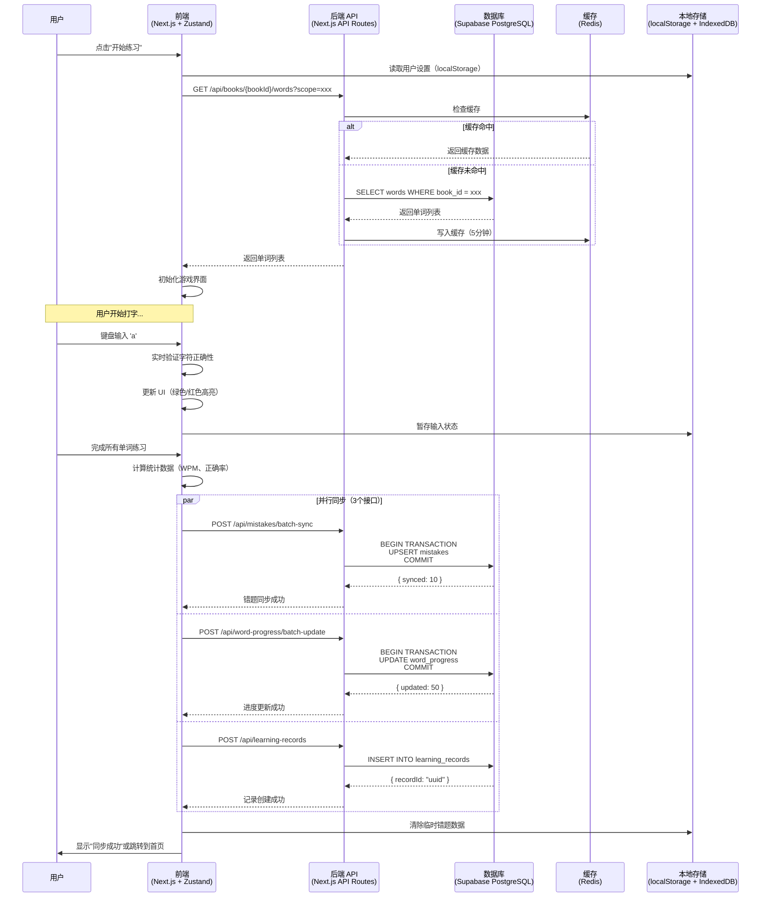
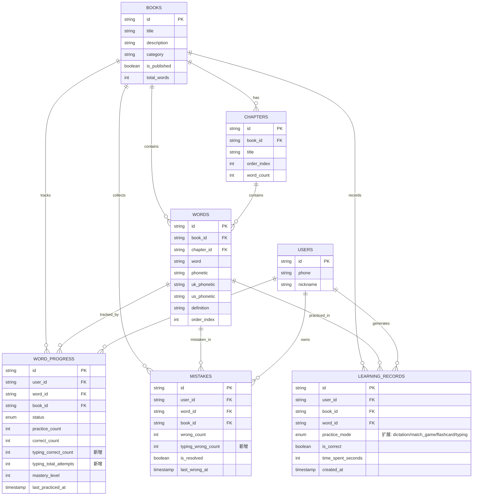
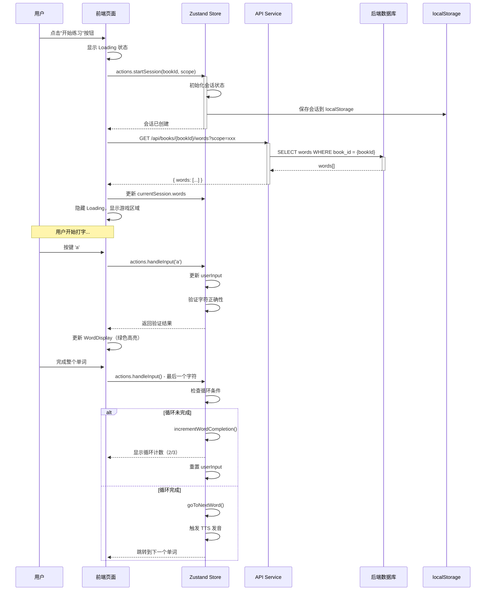
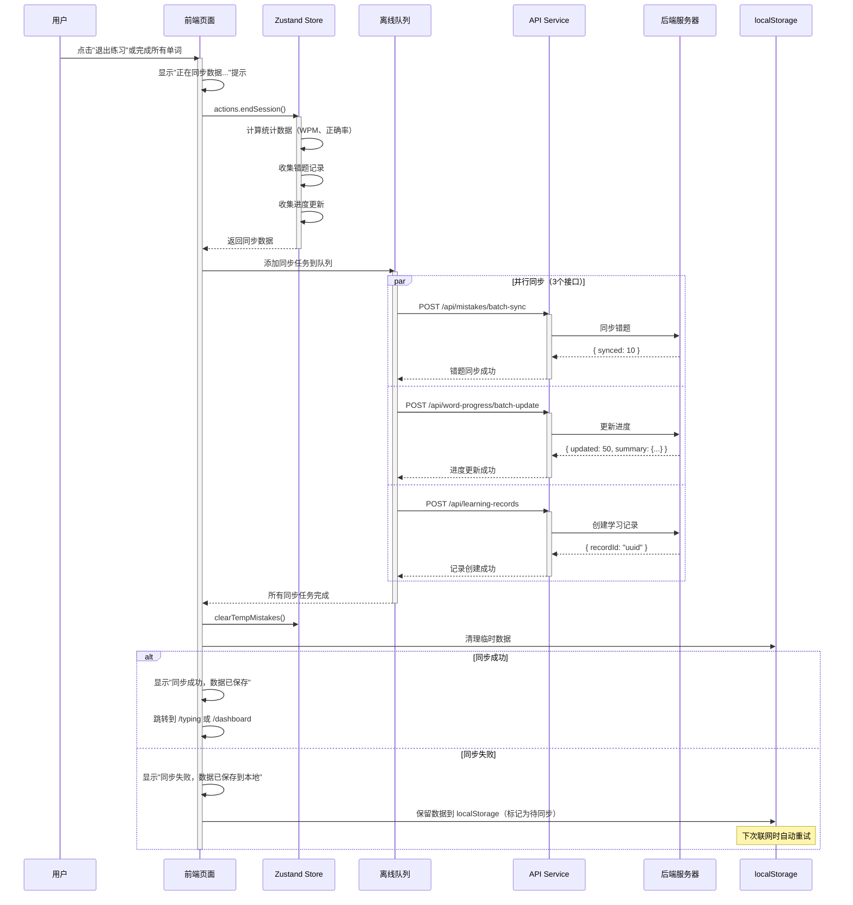

# 打字练习（肌肉训练）模块 技术设计文档 v1.0

**项目名称**：打字练习（肌肉训练）功能
**文档版本**：v1.0
**创建日期**：2026-01-16
**技术负责人**：[待定]
**文档状态**：待评审

---

## 1. 背景与目标

### 1.1 需求背景

打字练习（肌肉训练）是小语笔记-英语平台的第四大核心学习模式，与卡片背单词、听写模式、消消乐并列。通过实时键盘输入强化肌肉记忆，帮助用户掌握单词拼写。

**核心功能**：
- 实时打字检测：绿色高亮正确，红色高亮错误，连续错误 3 次自动重练
- TTS 发音系统：支持美音/英音，单词打对后自动发音
- 循环练习：支持 1/3/5/9/无限循环模式
- 错题本系统：自动记录错题，支持专项练习
- 数据同步：练习时存 localStorage，结束后批量同步到服务器

**用户旅程**：
```
首页左侧导航"肌肉训练"
  → 选择词书
  → 选择范围（未标注/已认识/模糊/不认识/全部）
  → 开始打字练习
  → 自动同步数据
```

### 1.2 技术目标

| 目标类型 | 具体指标 |
|---------|---------|
| **性能** | 页面 FCP < 1.5s，API P95 延迟 < 100ms（单词列表），支持 10000+ 单词流畅滚动 |
| **可用性** | 数据同步成功率 > 95%，支持离线练习 |
| **安全性** | 防止越权访问、SQL 注入、XSS 攻击 |
| **扩展性** | 支持 10 倍业务增长（100,000 用户 × 10,000 单词） |
| **兼容性** | 零停机迁移，历史数据自动填充默认值 |

---

## 2. 总体设计

### 2.1 系统交互图



### 2.2 技术栈

| 层级 | 技术选型 | 版本 | 说明 |
|------|---------|------|------|
| **前端框架** | Next.js | 16.1.1 | App Router + Server Components |
| **前端状态** | Zustand | 最新 | 轻量状态管理，支持持久化 |
| **样式方案** | Tailwind CSS | 4.0 | 原子化 CSS |
| **动画库** | Framer Motion | 最新 | 声明式动画 |
| **后端框架** | Next.js API Routes | 16.1.1 | 与前端同构 |
| **数据库** | Supabase (PostgreSQL) | 15+ | 支持事务、RLS |
| **缓存** | Redis | 7+ | 统计数据缓存 |
| **存储** | localStorage + IndexedDB | - | 前端离线存储 |

---

## 3. 详细设计：数据库

### 3.1 ER 模型图



**图例说明**：
- 🟦 **蓝色实体**：现有表（保持不变）
- 🟨 **黄色字段**：新增字段
- 🔗 **关系**：`||--o{` 表示一对多关系

### 3.2 DDL 变更脚本

#### 变更 1：扩展 `learning_records` 表的 `practice_mode` 字段

```sql
-- 步骤 1：将 ENUM 改为 TEXT（支持扩展）
ALTER TABLE learning_records
ALTER COLUMN practice_mode TYPE TEXT USING practice_mode::TEXT;

-- 步骤 2：删除旧的约束
ALTER TABLE learning_records
DROP CONSTRAINT IF EXISTS learning_records_practice_mode_check;

-- 步骤 3：添加新的约束（包含 'typing'）
ALTER TABLE learning_records
ADD CONSTRAINT learning_records_practice_mode_check
CHECK (practice_mode IN ('dictation', 'match_game', 'flashcard', 'typing', NULL));

-- 步骤 4：添加注释
COMMENT ON COLUMN learning_records.practice_mode IS '练习模式: dictation(听写) | match_game(消消乐) | flashcard(卡片) | typing(打字练习/肌肉训练) | NULL(其他模式)';
```

#### 变更 2：修改 `word_progress` 表（新增拼写统计字段）

```sql
-- 添加拼写正确次数字段
ALTER TABLE word_progress
ADD COLUMN typing_correct_count INTEGER DEFAULT 0 NOT NULL;

COMMENT ON COLUMN word_progress.typing_correct_count IS '打字练习拼写正确次数（仅统计 typing 模式）';

-- 添加拼写总尝试次数字段
ALTER TABLE word_progress
ADD COLUMN typing_total_attempts INTEGER DEFAULT 0 NOT NULL;

COMMENT ON COLUMN word_progress.typing_total_attempts IS '打字练习总尝试次数（仅统计 typing 模式）';

-- 添加数据完整性约束
ALTER TABLE word_progress
ADD CONSTRAINT word_progress_typing_stats_check
CHECK (typing_correct_count >= 0 AND typing_total_attempts >= 0);

ALTER TABLE word_progress
ADD CONSTRAINT word_progress_typing_attempts_check
CHECK (typing_total_attempts >= typing_correct_count);

-- 添加上限约束（防止无限循环导致溢出）
ALTER TABLE word_progress
ADD CONSTRAINT word_progress_typing_total_attempts_limit_check
CHECK (typing_total_attempts <= 10000);
```

#### 变更 3：修改 `mistakes` 表（新增拼写错误统计字段）

```sql
-- 添加拼写错误次数字段
ALTER TABLE mistakes
ADD COLUMN typing_wrong_count INTEGER DEFAULT 0 NOT NULL;

COMMENT ON COLUMN mistakes.typing_wrong_count IS '打字练习拼写错误次数（连续错误累积）';

-- 添加数据完整性约束
ALTER TABLE mistakes
ADD CONSTRAINT mistakes_typing_wrong_count_check
CHECK (typing_wrong_count >= 0);

-- 添加上限约束（防止恶意或异常数据）
ALTER TABLE mistakes
ADD CONSTRAINT mistakes_typing_wrong_count_limit_check
CHECK (typing_wrong_count <= 1000);
```

#### 变更 4：添加索引（优化查询性能）

```sql
-- 优化打字练习记录查询
CREATE INDEX IF NOT EXISTS idx_learning_records_typing_mode
ON learning_records(user_id, book_id, practice_mode)
WHERE practice_mode = 'typing';

-- 优化错题本查询（拼写错误）
CREATE INDEX IF NOT EXISTS idx_mistakes_typing_wrong_count
ON mistakes(user_id, book_id, typing_wrong_count)
WHERE typing_wrong_count > 0;

-- 优化错题本查询（已解决/未解决）
CREATE INDEX IF NOT EXISTS idx_mistakes_user_resolved
ON mistakes(user_id, book_id, is_resolved);
```

### 3.3 数据字典

#### 3.3.1 核心字段表

| 表名 | 字段名 | 类型 | 长度 | 必填 | 默认值 | 约束 | 说明 |
|-----|-------|------|------|------|--------|------|------|
| **learning_records** | practice_mode | VARCHAR/TEXT | 20 | ❌ | NULL | CHECK (dictation\|match_game\|flashcard\|typing\|NULL) | 练习模式（**已扩展**） |
| **word_progress** | typing_correct_count | INTEGER | - | ✅ | 0 | ≥ 0, ≤ 10000 | 打字练习拼写正确次数（**新增**） |
| **word_progress** | typing_total_attempts | INTEGER | - | ✅ | 0 | ≥ 0, ≤ 10000, ≥ typing_correct_count | 打字练习总尝试次数（**新增**） |
| **mistakes** | typing_wrong_count | INTEGER | - | ✅ | 0 | ≥ 0, ≤ 1000 | 打字练习拼写错误次数（**新增**） |

#### 3.3.2 枚举值详细定义

**practice_mode（学习模式）**

| 值 | 中文名称 | 说明 | 对应页面 |
|---|---------|------|---------|
| `dictation` | 听写模式 | 听音拼写单词 | `/study/[bookId]/dictation` |
| `match_game` | 消消乐 | 单词配对游戏 | `/study/[bookId]/match-game` |
| `flashcard` | 卡片背单词 | 翻转卡片记忆 | `/study/[bookId]/flashcards` |
| `typing` | 打字练习/肌肉训练 | 实时拼写检测 | `/typing/[bookId]/practice` |
| `NULL` | 其他模式 | 未知或历史数据 | - |

**status（学习状态）**

| 值 | 中文名称 | 自动更新规则 |
|---|---------|-------------|
| `new` | 未标注 | 从未练习过的单词 |
| `known` | 认识 | 正确率 ≥ 90% |
| `fuzzy` | 模糊 | 正确率 60%-89% |
| `unknown` | 不认识 | 正确率 < 60% |

### 3.4 兼容性处理

#### 3.4.1 数据迁移策略

**迁移方案：零停机迁移（推荐）⭐**

```sql
-- ===== 第一阶段：添加新字段（立即生效） =====
ALTER TABLE word_progress ADD COLUMN typing_correct_count INTEGER DEFAULT 0 NOT NULL;
ALTER TABLE word_progress ADD COLUMN typing_total_attempts INTEGER DEFAULT 0 NOT NULL;
ALTER TABLE mistakes ADD COLUMN typing_wrong_count INTEGER DEFAULT 0 NOT NULL;

-- ===== 第二阶段：扩展枚举约束 =====
BEGIN;
  ALTER TABLE learning_records ALTER COLUMN practice_mode TYPE TEXT;
  ALTER TABLE learning_records DROP CONSTRAINT IF EXISTS learning_records_practice_mode_check;
  ALTER TABLE learning_records ADD CONSTRAINT learning_records_practice_mode_check
    CHECK (practice_mode IN ('dictation', 'match_game', 'flashcard', 'typing', NULL));
COMMIT;

-- ===== 第三阶段：验证数据完整性 =====
SELECT
    COUNT(*) as total_records,
    COUNT(CASE WHEN practice_mode = 'typing' THEN 1 END) as typing_records
FROM learning_records;

SELECT
    COUNT(*) as total_progress,
    SUM(typing_correct_count) as total_typing_correct,
    SUM(typing_total_attempts) as total_typing_attempts
FROM word_progress;

SELECT
    COUNT(*) as total_mistakes,
    SUM(typing_wrong_count) as total_typing_wrong
FROM mistakes;
```

**回滚方案（应急）**：

```sql
-- 回滚步骤 1：删除新字段
ALTER TABLE word_progress DROP COLUMN IF EXISTS typing_correct_count;
ALTER TABLE word_progress DROP COLUMN IF EXISTS typing_total_attempts;
ALTER TABLE mistakes DROP COLUMN IF EXISTS typing_wrong_count;

-- 回滚步骤 2：恢复枚举约束
BEGIN;
  ALTER TABLE learning_records DROP CONSTRAINT IF EXISTS learning_records_practice_mode_check;
  ALTER TABLE learning_records ADD CONSTRAINT learning_records_practice_mode_check
    CHECK (practice_mode IN ('dictation', 'match_game', 'flashcard', NULL));
COMMIT;
```

#### 3.4.2 数据兼容性保证

| 设计要点 | 说明 | 风险评估 |
|---------|------|---------|
| **默认值策略** | 所有新增字段均设置 `DEFAULT 0 NOT NULL`，确保历史记录自动填充为 0 | ✅ 无风险 |
| **枚举扩展** | `practice_mode` 从 ENUM 扩展为 TEXT + CHECK 约束，向后兼容 | ✅ 无风险 |
| **可选字段** | 新增字段不影响现有查询逻辑（旧代码忽略即可） | ✅ 无风险 |
| **空值处理** | `practice_mode` 允许 NULL，兼容未知模式 | ✅ 无风险 |

---

## 4. 详细设计：后端

### 4.1 接口定义

#### 接口 1：获取单词列表（支持范围筛选）

```http
GET /api/books/{bookId}/words
```

**Path Parameters**：
```json
{
  "bookId": "string (UUID) - 词书ID"
}
```

**Query Parameters**：
```typescript
{
  scope?: 'new' | 'known' | 'fuzzy' | 'unknown' | 'all',  // 学习状态范围
  pageSize?: number,   // 每页数量（默认100，最大10000）
  page?: number,       // 页码（默认1）
  shuffle?: boolean,   // 是否乱序（默认false）
  chapterIds?: string[],  // 章节ID列表（逗号分隔，可选）
  themeIds?: string[],    // 主题ID列表（逗号分隔，可选）
  sceneIds?: string[]     // 场景ID列表（逗号分隔，可选）
}
```

**Response Body (200 OK)**：
```json
{
  "success": true,
  "data": {
    "words": [
      {
        "id": "uuid",
        "word": "abandon",
        "phonetic": "/əˈbændən/",
        "uk_phonetic": "/əˈbændən/",
        "us_phonetic": "/əˈbændən/",
        "definition": "放弃；遗弃",
        "definition_en": "to give up completely",
        "part_of_speech": "v.",
        "collocation": "abandon hope",
        "collocation_en": "abandon hope",
        "example_sentence": "Never <b>abandon</b> hope.",
        "example_sentence_en": "Never <b>abandon</b> hope.",
        "audio_url": "https://cdn.example.com/audio/abandon_us.mp3",
        "image_url": "https://cdn.example.com/images/abandon.jpg",
        "difficulty_score": 3,
        "frequency_rank": 1234,
        "order_index": 1
      }
    ],
    "pagination": {
      "total": 1973,
      "page": 1,
      "pageSize": 100,
      "totalPages": 20
    }
  }
}
```

**Error Codes**：

| Code | HTTP Status | Message | 场景 | 重试策略 |
|------|------------|---------|------|---------|
| `BOOK_NOT_FOUND` | 404 | 词书不存在 | bookId 无效 | 不重试 |
| `BOOK_NOT_AUTHORIZED` | 403 | 无权访问该词书 | 用户无权限 | 不重试 |
| `INVALID_SCOPE` | 400 | 无效的学习状态范围 | scope 参数错误 | 不重试 |
| `INVALID_PAGE_SIZE` | 400 | 每页数量超出限制 | pageSize > 10000 | 不重试 |
| `INTERNAL_ERROR` | 500 | 服务器内部错误 | 数据库查询失败 | 指数退避重试（3次） |

---

#### 接口 2：获取范围统计（用于范围选择页）

```http
GET /api/words/stats
```

**Query Parameters**：
```typescript
{
  bookId: string  // 词书ID（必填）
}
```

**Response Body (200 OK)**：
```json
{
  "success": true,
  "data": {
    "bookId": "uuid",
    "stats": {
      "new": 1200,      // 未标注
      "known": 450,     // 已认识
      "fuzzy": 89,      // 模糊
      "unknown": 234,   // 不认识
      "all": 1973       // 全部
    },
    "totalWords": 1973
  }
}
```

**Error Codes**：

| Code | HTTP Status | Message | 场景 |
|------|------------|---------|------|
| `BOOK_NOT_FOUND` | 404 | 词书不存在 | bookId 无效 |
| `MISSING_BOOK_ID` | 400 | 缺少词书ID | 未提供 bookId |
| `INTERNAL_ERROR` | 500 | 统计查询失败 | 数据库错误 |

---

#### 接口 3：批量同步错题（打字练习核心）

```http
POST /api/mistakes/batch-sync
```

**Request Body**：
```json
{
  "bookId": "uuid",
  "mistakes": [
    {
      "wordId": "uuid",
      "wrongCount": 3,        // 本次错误次数
      "typingWrongCount": 3   // 本次拼写错误次数（新增）
    }
  ]
}
```

**Response Body (200 OK)**：
```json
{
  "success": true,
  "data": {
    "synced": 10,        // 成功同步数量
    "failed": 0,         // 失败数量
    "errors": []         // 失败详情
  }
}
```

**Error Codes**：

| Code | HTTP Status | Message | 场景 |
|------|------------|---------|------|
| `UNAUTHORIZED` | 401 | 未登录 | 缺少认证令牌 |
| `BOOK_NOT_FOUND` | 404 | 词书不存在 | bookId 无效 |
| `INVALID_MISTAKES_DATA` | 400 | 错题数据格式错误 | mistakes 数组格式错误 |
| `WORD_NOT_FOUND` | 404 | 单词不存在 | wordId 无效（部分失败） |
| `INTERNAL_ERROR` | 500 | 同步失败 | 数据库事务失败 |

---

#### 接口 4：批量更新学习进度（打字练习核心）

```http
POST /api/word-progress/batch-update
```

**Request Body**：
```json
{
  "bookId": "uuid",
  "progress": [
    {
      "wordId": "uuid",
      "typingCorrectCount": 5,     // 本次正确次数
      "typingTotalAttempts": 7,    // 本次总尝试次数
      "accuracy": 0.71             // 计算后的正确率（71%）
    }
  ]
}
```

**Response Body (200 OK)**：
```json
{
  "success": true,
  "data": {
    "updated": 10,       // 成功更新数量
    "failed": 0,         // 失败数量
    "errors": [],        // 失败详情
    "summary": {
      "known": 3,        // 新增"认识"状态单词数
      "fuzzy": 5,        // 新增"模糊"状态单词数
      "unknown": 2       // 新增"不认识"状态单词数
    }
  }
}
```

**Error Codes**：

| Code | HTTP Status | Message | 场景 |
|------|------------|---------|------|
| `UNAUTHORIZED` | 401 | 未登录 | 缺少认证令牌 |
| `BOOK_NOT_FOUND` | 404 | 词书不存在 | bookId 无效 |
| `INVALID_PROGRESS_DATA` | 400 | 进度数据格式错误 | progress 数组格式错误 |
| `WORD_NOT_FOUND` | 404 | 单词不存在 | wordId 无效（部分失败） |
| `VERSION_CONFLICT` | 409 | 并发修改冲突 | 乐观锁版本冲突 |
| `INTERNAL_ERROR` | 500 | 更新失败 | 数据库事务失败 |

---

#### 接口 5：创建学习记录（打字练习结束）

```http
POST /api/learning-records
```

**Request Body**：
```json
{
  "bookId": "uuid",
  "wordIds": ["uuid1", "uuid2", ...],  // 练习的单词ID列表
  "practiceMode": "typing",
  "action": "typing_practice",
  "timeSpentSeconds": 600,
  "metadata": {
    "totalWords": 50,          // 练习单词总数
    "completedWords": 45,      // 完成单词数
    "skippedWords": 5,         // 跳过单词数
    "wpm": 35.5,               // 打字速度（每分钟单词数）
    "accuracy": 0.85,          // 总体正确率
    "mistakeCount": 15         // 错题总数
  }
}
```

**Response Body (200 OK)**：
```json
{
  "success": true,
  "data": {
    "recordId": "uuid",
    "createdAt": "2026-01-16T10:30:00Z"
  }
}
```

**Error Codes**：

| Code | HTTP Status | Message | 场景 |
|------|------------|---------|------|
| `UNAUTHORIZED` | 401 | 未登录 | 缺少认证令牌 |
| `BOOK_NOT_FOUND` | 404 | 词书不存在 | bookId 无效 |
| `INVALID_RECORD_DATA` | 400 | 记录数据格式错误 | 必填字段缺失 |
| `INTERNAL_ERROR` | 500 | 创建记录失败 | 数据库插入失败 |

---

#### 接口 6：获取错题列表（支持错题专项练习）

```http
GET /api/mistakes
```

**Query Parameters**：
```typescript
{
  bookId: string,              // 词书ID（必填）
  isResolved?: boolean,        // 是否已解决（可选，默认false）
  typingWrongOnly?: boolean,   // 仅显示拼写错题（可选，默认false）
  pageSize?: number,           // 每页数量（默认50）
  page?: number                // 页码（默认1）
}
```

**Response Body (200 OK)**：
```json
{
  "success": true,
  "data": {
    "mistakes": [
      {
        "id": "uuid",
        "word": {
          "id": "uuid",
          "word": "accommodation",
          "definition": "住宿；适应",
          "phonetic": "/əˌkɒməˈdeɪʃn/"
        },
        "wrongCount": 5,           // 总错误次数
        "typingWrongCount": 3,     // 拼写错误次数
        "lastWrongAt": "2026-01-16T10:00:00Z",
        "isResolved": false
      }
    ],
    "pagination": {
      "total": 25,
      "page": 1,
      "pageSize": 50,
      "totalPages": 1
    }
  }
}
```

**Error Codes**：

| Code | HTTP Status | Message | 场景 |
|------|------------|---------|------|
| `UNAUTHORIZED` | 401 | 未登录 | 缺少认证令牌 |
| `BOOK_NOT_FOUND` | 404 | 词书不存在 | bookId 无效 |
| `INTERNAL_ERROR` | 500 | 查询失败 | 数据库错误 |

---

#### 接口 7：获取练习统计数据

```http
GET /api/typing/stats
```

**Query Parameters**：
```typescript
{
  bookId?: string,      // 词书ID（可选）
  startDate?: string,   // 开始日期（ISO 8601，可选）
  endDate?: string      // 结束日期（ISO 8601，可选）
}
```

**Response Body (200 OK)**：
```json
{
  "success": true,
  "data": {
    "totalSessions": 15,          // 总练习次数
    "totalTimeSpentSeconds": 7200, // 总练习时长（秒）
    "totalWordsPracticed": 750,    // 总练习单词数
    "averageWpm": 32.5,            // 平均打字速度
    "averageAccuracy": 0.78,       // 平均正确率
    "dailyStats": [
      {
        "date": "2026-01-16",
        "sessions": 3,
        "timeSpentSeconds": 1200,
        "wordsPracticed": 150
      }
    ]
  }
}
```

**Error Codes**：

| Code | HTTP Status | Message | 场景 |
|------|------------|---------|------|
| `UNAUTHORIZED` | 401 | 未登录 | 缺少认证令牌 |
| `INVALID_DATE_RANGE` | 400 | 日期范围无效 | startDate > endDate |
| `INTERNAL_ERROR` | 500 | 统计查询失败 | 数据库聚合错误 |

---

### 4.2 核心业务逻辑

#### 4.2.1 批量同步错题

```typescript
/**
 * 批量同步错题（核心逻辑）
 */
async function batchSyncMistakes(
  userId: string,
  bookId: string,
  mistakes: Array<{ wordId: string, wrongCount: number, typingWrongCount: number }>
): Promise<{ synced: number, failed: number, errors: string[] }> {
  const result = { synced: 0, failed: 0, errors: [] };

  try {
    await database.beginTransaction({ isolationLevel: 'READ_COMMITTED' });

    for (const mistake of mistakes) {
      try {
        // 1. 校验单词是否存在
        const word = await database.query(
          'SELECT id FROM words WHERE id = $1 AND book_id = $2',
          [mistake.wordId, bookId]
        );

        if (!word) {
          result.failed++;
          result.errors.push(`Word ${mistake.wordId} not found`);
          continue; // 跳过无效单词，继续处理下一个
        }

        // 2. 查询现有错题记录
        const existing = await database.query(
          'SELECT wrong_count, typing_wrong_count FROM mistakes WHERE user_id = $1 AND word_id = $2 AND book_id = $3',
          [userId, mistake.wordId, bookId]
        );

        if (existing) {
          // 3. 更新现有记录（累加）
          await database.query(
            'UPDATE mistakes SET wrong_count = wrong_count + $1, typing_wrong_count = typing_wrong_count + $2, last_wrong_at = NOW(), is_resolved = false WHERE user_id = $3 AND word_id = $4 AND book_id = $5',
            [mistake.wrongCount, mistake.typingWrongCount, userId, mistake.wordId, bookId]
          );
        } else {
          // 4. 插入新记录
          await database.query(
            'INSERT INTO mistakes (user_id, word_id, book_id, wrong_count, typing_wrong_count, last_wrong_at, is_resolved) VALUES ($1, $2, $3, $4, $5, NOW(), false)',
            [userId, mistake.wordId, bookId, mistake.wrongCount, mistake.typingWrongCount]
          );
        }

        result.synced++;
      } catch (error) {
        result.failed++;
        result.errors.push(`Failed to sync word ${mistake.wordId}: ${error.message}`);
        // 继续处理下一个（容错设计）
      }
    }

    await database.commitTransaction();
    return result;
  } catch (error) {
    await database.rollbackTransaction();
    throw new Error(`Batch sync failed: ${error.message}`);
  }
}
```

#### 4.2.2 批量更新学习进度（核心状态流转逻辑）

```typescript
/**
 * 批量更新学习进度（核心逻辑）
 */
async function batchUpdateProgress(
  userId: string,
  bookId: string,
  progress: Array<{ wordId: string, typingCorrectCount: number, typingTotalAttempts: number, accuracy: number }>
): Promise<{ updated: number, summary: { known: number, fuzzy: number, unknown: number } }> {
  const summary = { known: 0, fuzzy: 0, unknown: 0 };
  let updated = 0;

  try {
    // 使用 SERIALIZABLE 隔离级别保证并发安全
    await database.beginTransaction({ isolationLevel: 'SERIALIZABLE' });

    for (const item of progress) {
      // 1. 根据正确率计算学习状态（核心业务逻辑）
      const status = calculateStatus(item.accuracy);
      summary[status]++;

      // 2. 计算掌握程度（0-100）
      const masteryLevel = calculateMasteryLevel(
        item.typingCorrectCount,
        item.typingTotalAttempts
      );

      // 3. 查询现有进度（使用乐观锁）
      const existing = await database.query(
        'SELECT typing_correct_count, typing_total_attempts, version FROM word_progress WHERE user_id = $1 AND word_id = $2 AND book_id = $3',
        [userId, item.wordId, bookId]
      );

      if (existing) {
        // 4. 更新现有记录（累加拼写统计，保留其他模式统计）
        const affectedRows = await database.query(
          `UPDATE word_progress SET
           status = $1,
           typing_correct_count = typing_correct_count + $2,
           typing_total_attempts = typing_total_attempts + $3,
           mastery_level = $4,
           last_practiced_at = NOW(),
           version = version + 1
           WHERE user_id = $5 AND word_id = $6 AND book_id = $7 AND version = $8`,
          [status, item.typingCorrectCount, item.typingTotalAttempts, masteryLevel, userId, item.wordId, bookId, existing.version]
        );

        // 5. 检查乐观锁冲突
        if (affectedRows === 0) {
          throw new Error(`Version conflict for word ${item.wordId}`);
        }
      } else {
        // 6. 插入新记录
        await database.query(
          `INSERT INTO word_progress
           (user_id, word_id, book_id, status, typing_correct_count, typing_total_attempts, mastery_level, practice_count, correct_count, version, last_practiced_at)
           VALUES ($1, $2, $3, $4, $5, $6, $7, 0, 0, 1, NOW())`,
          [userId, item.wordId, bookId, status, item.typingCorrectCount, item.typingTotalAttempts, masteryLevel]
        );
      }

      updated++;
    }

    await database.commitTransaction();

    // 7. 清除缓存
    await cache.delete(`user:progress:${userId}:${bookId}`);

    return { updated, summary };
  } catch (error) {
    await database.rollbackTransaction();
    throw new Error(`Batch update failed: ${error.message}`);
  }
}

/**
 * 根据正确率计算学习状态（核心算法）
 */
function calculateStatus(accuracy: number): 'known' | 'fuzzy' | 'unknown' {
  if (accuracy >= 0.9) return 'known';      // ≥90%: 认识
  if (accuracy >= 0.6) return 'fuzzy';      // 60%-89%: 模糊
  return 'unknown';                         // <60%: 不认识
}

/**
 * 计算掌握程度（核心算法）
 */
function calculateMasteryLevel(correctCount: number, totalCount: number): number {
  if (totalCount === 0) return 0;

  const accuracy = correctCount / totalCount;

  // 考虑练习次数的权重（练习越多，掌握程度越高）
  const practiceWeight = Math.min(totalCount / 10, 1.0); // 最多10次达到满权重

  return Math.round((accuracy * 0.7 + practiceWeight * 0.3) * 100);
}
```

#### 4.2.3 检查错题是否已解决（错题专项练习）

```typescript
/**
 * 检查错题是否已解决（核心业务规则）
 */
async function checkIfMistakeResolved(
  userId: string,
  wordId: string,
  accuracy: number
): Promise<boolean> {
  // 规则：正确率 ≥ 90%，标记为已解决
  if (accuracy >= 0.9) {
    await database.query(
      'UPDATE mistakes SET is_resolved = true, resolved_at = NOW() WHERE user_id = $1 AND word_id = $2',
      [userId, wordId]
    );
    return true;
  }

  return false;
}
```

### 4.3 事务与锁

#### 4.3.1 事务支持

| 操作 | 事务级别 | 说明 | 隔离级别 |
|------|---------|------|---------|
| **批量同步错题** | REQUIRED | 需要保证 upsert 操作的原子性 | READ_COMMITTED |
| **批量更新进度** | REQUIRED | 需要保证 status 和 mastery_level 的一致性 | SERIALIZABLE |
| **创建学习记录** | REQUIRED | 单条插入，失败不影响其他操作 | READ_COMMITTED |

#### 4.3.2 并发控制

**乐观锁（推荐用于 word_progress 更新）**：

```sql
-- 1. 添加 version 字段
ALTER TABLE word_progress ADD COLUMN version INTEGER DEFAULT 1;

-- 2. 更新时检查版本
UPDATE word_progress
SET status = $1,
    typing_correct_count = typing_correct_count + $2,
    version = version + 1
WHERE user_id = $3
  AND word_id = $4
  AND version = $5;  -- 前端传入的版本号

-- 3. 检查 affected_rows
-- 如果 affected_rows = 0，说明版本冲突，返回 409 错误给前端
```

**悲观锁（用于高并发场景）**：

```sql
-- 使用 FOR UPDATE 行级锁
BEGIN TRANSACTION;
  SELECT typing_correct_count, typing_total_attempts, version
  FROM word_progress
  WHERE user_id = $1 AND word_id = $2
  FOR UPDATE;  -- 锁定该行，防止并发修改

  UPDATE word_progress
  SET typing_correct_count = typing_correct_count + $3,
      version = version + 1
  WHERE user_id = $1 AND word_id = $2;
COMMIT;
```

---

## 5. 详细设计：前端

### 5.1 组件结构

#### 5.1.1 路由结构树状图

```mermaid
graph TD
    Root[/'/']

    Root --> Dashboard['/dashboard']
    Root --> Typing['/typing - 肌肉训练入口']

    Typing --> TypingBookList['/typing - 词书列表页']
    TypingBookList --> TypingBookDetail['/typing/[bookId] - 范围选择页']
    TypingBookDetail --> TypingPractice['/typing/[bookId]/practice - 核心游戏页']

    Dashboard --> |快捷入口| TypingPractice

    subgraph 组件层级
        TypingBookList --> BL_Header[页面头部]
        TypingBookList --> BL_BookGrid[词书网格]
        BL_BookGrid --> BL_BookCard[词书卡片 x N]

        TypingBookDetail --> BD_Header[返回按钮 + 词书信息]
        TypingBookDetail --> BD_ScopeGrid[范围选择网格]
        BD_ScopeGrid --> BD_ScopeCard[范围卡片 x 5]

        TypingPractice --> TP_GameArea[游戏区域]
        TP_GameArea --> TP_WordDisplay[单词显示区]
        TP_GameArea --> TP_InputArea[输入区域]
        TP_GameArea --> TP_Feedback[实时反馈层]

        TypingPractice --> TP_ControlBar[灵动岛控制栏]
        TP_ControlBar --> TP_SettingsBtn[设置按钮]
        TP_ControlBar --> TP_MistakesBtn[错题本按钮]
        TP_ControlBar --> TP_LoopBtn[循环设置]
        TP_ControlBar --> TP_StatsBtn[统计面板]
        TP_ControlBar --> TP_ExitBtn[退出按钮]

        TypingPractice --> TP_Modals[对话框组]
        TP_Modals --> TP_SettingsModal[设置对话框]
        TP_Modals --> TP_MistakesModal[错题本面板]
        TP_Modals --> TP_StatsModal[统计面板]
        TP_Modals --> TP_CompleteModal[完成对话框]
    end
```

#### 5.1.2 目录结构

```
src/
├── app/
│   ├── typing/
│   │   ├── page.tsx                          # 词书列表页
│   │   ├── [bookId]/
│   │   │   ├── page.tsx                      # 范围选择页
│   │   │   └── practice/
│   │   │       └── page.tsx                  # 核心游戏页
│   │   └── components/
│   │       ├── BookCard.tsx                  # 词书卡片
│   │       ├── ScopeCard.tsx                 # 范围选择卡片
│   │       ├── GameArea.tsx                  # 游戏区域组件
│   │       ├── WordDisplay.tsx               # 单词显示组件
│   │       ├── TypingInput.tsx               # 打字输入组件
│   │       ├── ControlBar.tsx                # 灵动岛控制栏
│   │       ├── SettingsModal.tsx             # 设置对话框
│   │       ├── MistakesPanel.tsx             # 错题本面板
│   │       ├── StatsPanel.tsx                # 统计面板
│   │       └── CompleteDialog.tsx            # 完成对话框
│
├── stores/                                    # 状态管理
│   ├── typingStore.ts                        # 打字练习全局状态
│   ├── progressStore.ts                      # 学习进度状态
│   ├── mistakesStore.ts                      # 错题本状态
│   └── settingsStore.ts                      # 用户设置状态
│
├── hooks/
│   ├── useTypingEngine.ts                    # 打字检测引擎
│   ├── useTTSEngine.ts                       # TTS 发音引擎
│   ├── useMistakeBook.ts                     # 错题本管理
│   ├── useDataSync.ts                        # 数据同步
│   ├── useKeyboardShortcuts.ts               # 快捷键处理
│   └── useLocalStorage.ts                    # 本地存储
│
├── services/
│   ├── api/
│   │   ├── typing.ts                         # 打字练习 API
│   │   ├── words.ts                          # 单词 API
│   │   ├── mistakes.ts                       # 错题 API
│   │   └── progress.ts                       # 进度 API
│   └── sync/
│       ├── syncService.ts                    # 同步服务
│       └── offlineManager.ts                 # 离线管理
│
├── lib/
│   ├── typing-validator.ts                   # 打字验证逻辑
│   ├── status-calculator.ts                  # 状态计算工具
│   └── constants.ts                          # 常量定义
│
└── types/
    ├── typing.ts                             # 打字练习类型定义
    ├── store.ts                              # Store 类型定义
    └── api.ts                                # API 类型定义
```

### 5.2 状态管理

#### 5.2.1 全局 Store 数据结构

```typescript
// src/stores/typingStore.ts
import { create } from 'zustand'
import { persist, createJSONStorage } from 'zustand/middleware'

interface TypingState {
  // ==================== 当前会话状态 ====================
  currentSession: {
    bookId: string | null
    scope: ScopeType | null
    currentWordIndex: number
    words: Word[]              // 当前练习的单词列表
    userInput: string          // 用户输入
    isPlaying: boolean         // 是否正在练习
    isPaused: boolean          // 是否暂停
    startTime: number | null   // 会话开始时间戳
    endTime: number | null     // 会话结束时间戳
  }

  // ==================== 循环设置 ====================
  loopSettings: {
    enabled: boolean           // 是否启用循环
    loopCount: number          // 循环次数（0=无限，1=不循环，3=3次循环）
    currentWordCompletionCount: number  // 当前单词完成次数
  }

  // ==================== 错题记录（临时） ====================
  tempMistakes: Map<string, MistakeRecord>  // wordId -> MistakeRecord

  // ==================== 用户设置 ====================
  settings: {
    // 发音设置
    wordAutoPronounce: boolean
    wordVolume: number         // 0-100
    wordSpeed: number          // 0.5-2.0
    pronunciationScheme: 'us' | 'uk' | 'auto'

    // 显示设置
    foreignFontSize: number    // 20-100px
    chineseFontSize: number    // 12-50px
    darkMode: boolean
    showTranslation: boolean   // 是否显示中文释义
    blindMode: boolean         // 默写模式

    // 循环设置
    defaultLoopCount: number   // 1/3/5/9/0（无限）
  }

  // ==================== 统计数据（会话级） ====================
  statistics: {
    totalWords: number         // 总单词数
    completedWords: number     // 已完成单词数
    skippedWords: number       // 跳过单词数
    correctCount: number       // 正确字符数
    errorCount: number         // 错误字符数
    wpm: number                // 打字速度（每分钟单词数）
    accuracy: number           // 正确率（0-1）
  }

  // ==================== UI 状态 ====================
  ui: {
    modalsOpen: {
      settings: boolean
      mistakes: boolean
      stats: boolean
      shortcuts: boolean
      complete: boolean
    }
    activeTab: SettingsTabType
    charErrorCount: number[]   // 每个字符的错误次数（用于显示红色高亮）
    shakeTrigger: number       // 触发震动动画
  }

  // ==================== Actions ====================
  actions: {
    // 会话管理
    startSession: (bookId: string, scope: ScopeType, words: Word[]) => void
    pauseSession: () => void
    resumeSession: () => void
    endSession: () => Promise<void>

    // 单词导航
    goToNextWord: () => void
    goToPreviousWord: () => void
    skipWord: () => void

    // 输入处理
    handleInput: (char: string) => void
    handleBackspace: () => void
    resetCurrentWord: () => void

    // 循环控制
    setLoopCount: (count: number) => void
    incrementWordCompletion: () => void

    // 错题记录
    addMistake: (wordId: string, mistakeCount: number) => void
    clearTempMistakes: () => void

    // 设置
    updateSettings: (settings: Partial<TypingState['settings']>) => void

    // UI 控制
    openModal: (modal: keyof TypingState['ui']['modalsOpen']) => void
    closeModal: (modal: keyof TypingState['ui']['modalsOpen']) => void
    triggerShake: () => void
  }
}

// 创建 Store（持久化配置）
export const useTypingStore = create<TypingState>()(
  persist(
    (set, get) => ({
      // 初始状态
      currentSession: {
        bookId: null,
        scope: null,
        currentWordIndex: 0,
        words: [],
        userInput: '',
        isPlaying: false,
        isPaused: false,
        startTime: null,
        endTime: null,
      },

      loopSettings: {
        enabled: false,
        loopCount: 1,
        currentWordCompletionCount: 0,
      },

      tempMistakes: new Map(),

      settings: {
        wordAutoPronounce: true,
        wordVolume: 80,
        wordSpeed: 1.0,
        pronunciationScheme: 'us',
        foreignFontSize: 48,
        chineseFontSize: 18,
        darkMode: false,
        showTranslation: true,
        blindMode: false,
        defaultLoopCount: 1,
      },

      statistics: {
        totalWords: 0,
        completedWords: 0,
        skippedWords: 0,
        correctCount: 0,
        errorCount: 0,
        wpm: 0,
        accuracy: 0,
      },

      ui: {
        modalsOpen: {
          settings: false,
          mistakes: false,
          stats: false,
          shortcuts: false,
          complete: false,
        },
        activeTab: 'sound',
        charErrorCount: [],
        shakeTrigger: 0,
      },

      // Actions 实现
      actions: {
        startSession: (bookId, scope, words) => {
          set({
            currentSession: {
              bookId,
              scope,
              currentWordIndex: 0,
              words,
              userInput: '',
              isPlaying: true,
              isPaused: false,
              startTime: Date.now(),
              endTime: null,
            },
            statistics: {
              totalWords: words.length,
              completedWords: 0,
              skippedWords: 0,
              correctCount: 0,
              errorCount: 0,
              wpm: 0,
              accuracy: 0,
            },
            tempMistakes: new Map(),
          })
        },

        // ... 其他 actions 实现
      },
    }),
    {
      name: 'typing-storage',       // localStorage key
      storage: createJSONStorage(() => localStorage),
      // 持久化配置
      partialize: (state) => ({
        // 持久化：用户设置
        settings: state.settings,
        // 持久化：循环设置
        loopSettings: state.loopSettings,
        // 持久化：当前会话（恢复进度）
        currentSession: {
          bookId: state.currentSession.bookId,
          scope: state.currentSession.scope,
          currentWordIndex: state.currentSession.currentWordIndex,
          words: state.currentSession.words,
        },
        // 不持久化：临时状态（UI、tempMistakes、statistics）
      }),
    }
  )
)
```

#### 5.2.2 持久化策略矩阵

| 数据类型 | 存储位置 | 持久化时机 | 清理时机 | 说明 |
|---------|---------|-----------|---------|------|
| **用户设置** | localStorage | 实时保存 | 永不 | 使用 Zustand persist |
| **当前会话（进度）** | localStorage | 每 5 秒自动保存 | 会话结束后 24 小时 | 支持刷新恢复 |
| **错题记录（临时）** | localStorage | 内存（Map） | 同步到服务器后 | 双存储：内存 + localStorage |
| **统计数据** | 内存（Store） | 不持久化 | 会话结束 | 仅当前会话有效 |
| **UI 状态** | 内存（Store） | 不持久化 | 组件卸载 | modalsOpen, charErrorCount |
| **TTS 缓存音频** | IndexedDB | 首次生成后 | 7 天未访问 | 减少网络请求 |

### 5.3 核心组件接口

#### 5.3.1 BookCard（词书卡片）

```typescript
// src/app/typing/components/BookCard.tsx

interface BookCardProps {
  // 数据
  book: {
    id: string
    title: string
    description: string
    coverUrl: string | null
    totalWords: number
  }

  // 状态
  isLoading?: boolean

  // 样式
  className?: string

  // 事件
  onClick?: (bookId: string) => void
}

// 使用示例
<BookCard
  book={{
    id: 'xxx',
    title: 'CET-4 核心词汇',
    description: '大学英语四级核心词汇',
    coverUrl: '/covers/cet4.jpg',
    totalWords: 1973,
  }}
  onClick={(bookId) => {
    router.push(`/typing/${bookId}`)
  }}
/>
```

#### 5.3.2 ScopeCard（范围选择卡片）

```typescript
// src/app/typing/[bookId]/components/ScopeCard.tsx

interface ScopeCardProps {
  // 数据
  scope: ScopeType
  count: number              // 单词数量
  label: string             // 显示文本（如"未标注"、"已认识"）
  description?: string      // 描述文本

  // 状态
  isActive?: boolean        // 是否选中
  isDisabled?: boolean      // 是否禁用（count === 0）
  isLoading?: boolean       // 加载状态

  // 样式
  variant?: 'default' | 'compact'

  // 事件
  onClick?: (scope: ScopeType) => void
}

type ScopeType = 'new' | 'known' | 'fuzzy' | 'unknown' | 'all'

// 颜色映射
const scopeColors: Record<ScopeType, string> = {
  new: 'gray',      // 灰色
  known: 'green',   // 绿色
  fuzzy: 'yellow',  // 黄色
  unknown: 'red',   // 红色
  all: 'blue',      // 蓝色
}
```

#### 5.3.3 GameArea（游戏区域组件）

```typescript
// src/app/typing/[bookId]/practice/components/GameArea.tsx

interface GameAreaProps {
  // 数据
  word: Word                // 当前单词
  userInput: string         // 用户输入
  charErrorCount: number[]  // 每个字符的错误次数

  // 设置
  settings: {
    foreignFontSize: number
    chineseFontSize: number
    showTranslation: boolean
    blindMode: boolean
  }

  // 状态
  isPlaying: boolean
  isPaused: boolean
  loopInfo: {
    enabled: boolean
    loopCount: number
    currentCompletion: number  // 2/3
  }

  // 事件
  onInput: (char: string) => void
  onBackspace: () => void
  onComplete: () => void
  onSkip: () => void
}
```

#### 5.3.4 WordDisplay（单词显示组件）

```typescript
// src/app/typing/[bookId]/practice/components/WordDisplay.tsx

interface WordDisplayProps {
  // 数据
  word: string              // "abandon"
  userInput: string         // "aban"
  charErrorCount: number[]  // [0, 0, 1, 0]

  // 设置
  fontSize: number          // 48
  isBlindMode: boolean      // 是否默写模式

  // 事件
  onAnimationComplete?: () => void
}
```

### 5.4 交互时序

#### 5.4.1 开始打字练习流程



#### 5.4.2 数据同步流程（练习结束）



#### 5.4.3 核心交互逻辑伪代码

```typescript
/**
 * 打字输入处理核心逻辑
 */
function handleKeyPress(event: KeyboardEvent, store: TypingStore) {
  const { currentSession, settings, loopSettings } = store.getState()
  const currentWord = currentSession.words[currentSession.currentWordIndex]
  const userInput = currentSession.userInput

  // 1. 忽略功能键
  if (event.key === 'Shift' || event.key === 'Control' || event.key === 'Alt') {
    return
  }

  // 2. 处理退格键
  if (event.key === 'Backspace') {
    if (userInput.length > 0) {
      const newInput = userInput.slice(0, -1)
      store.getState().actions.handleInput(newInput)
    }
    return
  }

  // 3. 处理跳过键（Esc）
  if (event.key === 'Escape') {
    const charErrorCount = store.getState().ui.charErrorCount
    const totalErrors = charErrorCount.reduce((sum, count) => sum + count, 0)

    if (totalErrors >= 4) {
      store.getState().actions.skipWord()
    }
    return
  }

  // 4. 处理快捷键
  if (event.ctrlKey && event.key === 'm') {
    store.getState().actions.updateSettings({ blindMode: !settings.blindMode })
    return
  }

  // 5. 验证输入（只接受字母）
  if (!/^[a-zA-Z]$/.test(event.key)) {
    return
  }

  const nextChar = currentWord.word[userInput.length]
  const inputChar = event.key

  // 6. 字符验证
  const isCorrect = inputChar.toLowerCase() === nextChar.toLowerCase()
  const newInput = userInput + inputChar

  // 7. 更新错误计数
  const newCharErrorCount = [...store.getState().ui.charErrorCount]
  if (!isCorrect) {
    newCharErrorCount[userInput.length] = (newCharErrorCount[userInput.length] || 0) + 1
    store.getState().actions.triggerShake()  // 触发震动动画
  }

  // 8. 更新 Store
  store.getState().actions.handleInput(newInput)

  // 9. 检查单词是否完成
  if (newInput.length === currentWord.word.length) {
    if (isCorrect) {
      // 单词正确，检查循环
      const currentCompletion = loopSettings.currentWordCompletionCount
      const targetLoops = loopSettings.loopCount

      if (currentCompletion + 1 < targetLoops) {
        // 循环未完成，重置输入
        store.getState().actions.incrementWordCompletion()
        setTimeout(() => {
          store.getState().actions.resetCurrentWord()
        }, 300)
      } else {
        // 循环完成，跳转下一词
        store.getState().actions.goToNextWord()
      }
    } else {
      // 单词错误，检查是否需要重练
      const totalErrors = newCharErrorCount.reduce((sum, count) => sum + count, 0)
      if (totalErrors >= 3) {
        // 3 次错误，自动重练
        setTimeout(() => {
          store.getState().actions.resetCurrentWord()
        }, 500)
      }
    }
  }
}
```

---

## 6. 风险与规避

### 6.1 边缘案例处理

#### 边缘案例 1：多端并发修改冲突（数据一致性风险）

**极端场景**：
```
时间线：
10:00:00  用户在 PC 端标签页A 开始练习单词 "abandon"
          本地状态：typing_correct_count = 0

10:00:15  用户在手机端继续练习同一词书
          调用 POST /api/word-progress/batch-update
          服务器：UPDATE typing_correct_count = 5

10:00:20  PC 端标签页A 完成练习
          调用 POST /api/word-progress/batch-update
          服务器：UPDATE typing_correct_count = 3（覆盖了手机端的 5！）

结果：数据丢失，最终 typing_correct_count = 3（应该是 8）
```

**当前设计的缺陷**：
- ❌ 后端在 Read-Modify-Write 之间有竞态条件时间窗口
- ❌ 前端 localStorage 在不同标签页间无法同步状态
- ❌ 缺少版本控制机制

**修复方案**：

**方案 1：乐观锁（推荐）⭐**
```sql
-- 1. 添加 version 字段
ALTER TABLE word_progress ADD COLUMN version INTEGER DEFAULT 1;

-- 2. 更新时检查版本
UPDATE word_progress
SET typing_correct_count = typing_correct_count + $1,
    typing_total_attempts = typing_total_attempts + $2,
    version = version + 1
WHERE user_id = $3
  AND word_id = $4
  AND version = $5;  -- 前端传入的版本号

-- 3. 检查 affected_rows
-- 如果 affected_rows = 0，说明版本冲突，返回 409 错误给前端
```

**方案 2：前端标签页同步**
```typescript
// 使用 BroadcastChannel API 跨标签页同步
const channel = new BroadcastChannel('typing-sync')

// 发送消息
channel.postMessage({
  type: 'WORD_PROGRESS_UPDATE',
  wordId: 'xxx',
  correctCount: 5,
})

// 接收消息
channel.onmessage = (event) => {
  if (event.data.type === 'WORD_PROGRESS_UPDATE') {
    // 更新本地状态
    store.getState().actions.syncFromOtherTab(event.data)
  }
}
```

---

#### 边缘案例 2：分布式事务部分失败（数据一致性风险）

**极端场景**：
```
用户完成练习，前端并行调用 3 个接口：

Promise.all([
  POST /api/mistakes/batch-sync,        // ✅ 成功
  POST /api/word-progress/batch-update, // ❌ 失败（500）
  POST /api/learning-records,           // ✅ 成功
])

结果：
- mistakes 表：已更新（错题已记录）
- word_progress 表：未更新（进度未保存）
- learning_records 表：已插入（记录显示已练习）

前端显示"同步失败"，但清除了 tempMistakes
用户重新同步时，错题重复插入！
```

**修复方案**：

**方案 1：Saga 模式（补偿事务）⭐**
```typescript
// 前端实现 Saga 协调器
async function syncDataWithSaga() {
  const saga = new Saga()

  // Step 1: 同步错题
  const mistakesResult = await saga.execute(
    () => api.mistakes.batchSync(...),
    (result) => api.mistakes.batchRevert(result)  // 补偿操作
  )

  // Step 2: 更新进度
  try {
    const progressResult = await saga.execute(
      () => api.progress.batchUpdate(...),
      (result) => api.progress.batchRevert(result)  // 补偿操作
    )
  } catch (error) {
    // 进度更新失败，回滚错题
    await saga.compensate()
    throw error
  }

  // Step 3: 创建记录
  await saga.execute(
    () => api.learningRecords.create(...),
    () => api.learningRecords.delete(recordId)  // 补偿操作
  )
}
```

**方案 2：后端聚合接口**
```http
# 新增聚合接口，在一个事务中完成所有操作
POST /api/typing/complete-session

Request Body:
{
  "bookId": "uuid",
  "mistakes": [...],
  "progress": [...],
  "metadata": {...}
}

后端实现：
BEGIN TRANSACTION;
  INSERT INTO mistakes ...;
  UPDATE word_progress ...;
  INSERT INTO learning_records ...;
COMMIT;  -- 全部成功或全部回滚
```

---

#### 边缘案例 3：无限循环导致资源耗尽（系统崩溃风险）

**极端场景**：
```
用户设置循环模式为"无限循环"（loopCount=0）
开始练习单词 "accommodation"（拼写很难）

循环计数：
- 第1次：错误（红色高亮）
- 第2次：错误
- 第3次：自动删除重练
- 第4次：显示"跳过"按钮
- 用户：点击"跳过"
- 系统：跳到下一个单词

但下一个单词又是 "accommodation"（错题专项练习模式）
用户又练习 4 次...
无限循环，永远无法完成！

前端问题：
- currentWordCompletionCount 一直递增
- charErrorCount 数组无限增长
- 内存泄漏

后端问题：
- typing_wrong_count 无限增长
- 数据库字段溢出
```

**修复方案**：

**方案 1：设置强制上限（推荐）⭐**
```typescript
// 前端：即使设置无限循环，也限制单次会话最多 100 次
const MAX_LOOPS_PER_SESSION = 100

if (loopSettings.currentWordCompletionCount >= MAX_LOOPS_PER_SESSION) {
  // 强制跳过
  alert('该单词练习次数过多，已自动跳过。建议稍后再试。')
  store.getState().actions.skipWord()
  return
}
```

**方案 2：数据库约束**
```sql
-- 添加 CHECK 约束，限制字段范围（已在 DDL 中实现）
ALTER TABLE word_progress
ADD CONSTRAINT typing_total_attempts_limit_check
CHECK (typing_total_attempts <= 10000);

ALTER TABLE mistakes
ADD CONSTRAINT typing_wrong_count_limit_check
CHECK (typing_wrong_count <= 1000);
```

---

### 6.2 安全隐患与修复

#### 安全隐患 1：越权访问词书（水平权限绕过）

**风险场景**：
```
攻击者 A 登录系统，拥有词书 "CET-4" 的访问权限

攻击者枚举其他 bookId：
GET /api/books/xxx-1/words  // 404 Not Found
GET /api/books/xxx-2/words  // 403 Forbidden（其他用户的自定义词书）
GET /api/books/xxx-3/words  // 200 OK（越权访问！）

如果后端只检查 bookId 是否存在，而不检查用户是否有权限，
攻击者可以遍历所有词书。
```

**修复方案**：

**后端权限检查（必须）⭐**
```typescript
app.get('/api/books/:bookId/words', async (req, res) => {
  const { bookId } = req.params
  const userId = req.user.id

  // 1. 检查词书是否存在
  const book = await db.query(
    'SELECT * FROM books WHERE id = $1',
    [bookId]
  )
  if (!book) return res.status(404).json({ error: 'BOOK_NOT_FOUND' })

  // 2. 检查词书是否已发布（官方词书）
  if (book.is_published === false) {
    // 3. 检查用户是否有权限（自定义词书）
    const hasPermission = await db.query(
      `SELECT 1 FROM user_books
       WHERE user_id = $1 AND book_id = $2`,
      [userId, bookId]
    )
    if (!hasPermission) {
      return res.status(403).json({ error: 'BOOK_NOT_AUTHORIZED' })
    }
  }

  // 4. 返回单词
  const words = await db.query(
    'SELECT * FROM words WHERE book_id = $1',
    [bookId]
  )
  res.json({ words })
})
```

---

#### 安全隐患 2：批量接口的注入攻击

**风险场景**：
```
攻击者构造恶意请求：
POST /api/mistakes/batch-sync
{
  "bookId": "valid-uuid",
  "mistakes": [
    {
      "wordId": "'; DROP TABLE mistakes; --",
      "wrongCount": 1,
      "typingWrongCount": 1
    }
  ]
}

如果后端使用字符串拼接 SQL，导致 SQL 注入！
```

**修复方案**：

**输入验证（使用 Zod）⭐**
```typescript
import { z } from 'zod'

const MistakeSchema = z.object({
  wordId: z.string().uuid(),           // 必须是有效 UUID
  wrongCount: z.number().int().min(0).max(100),  // 必须 >= 0 且 <= 100
  typingWrongCount: z.number().int().min(0).max(100),
})

const BatchSyncSchema = z.object({
  bookId: z.string().uuid(),
  mistakes: z.array(MistakeSchema).max(1000),  // 最多 1000 条
})

app.post('/api/mistakes/batch-sync', async (req, res) => {
  // 验证输入
  const validatedData = BatchSyncSchema.parse(req.body)

  // 继续处理...
})

// 使用参数化查询（防 SQL 注入）
const result = await db.query(
  'INSERT INTO mistakes (word_id, wrong_count) VALUES ($1, $2)',
  [mistake.wordId, mistake.wrongCount]  // 参数化查询，防注入
)
```

---

#### 安全隐患 3：敏感信息泄露到前端

**风险场景**：
```typescript
// localStorage 存储（当前设计）
localStorage.setItem('typing-storage', JSON.stringify({
  currentSession: {
    words: [...]  // 完整的单词列表，可能包含 10000 条
  },
  settings: {...}
}))

问题：
1. localStorage 明文存储，任何人都可以访问（XSS 攻击）
2. 单词列表可能包含付费内容（不应该缓存）
3. 用户设置可能包含敏感信息（如用户偏好）
```

**修复方案**：

**方案 1：敏感数据不持久化⭐**
```typescript
// ✅ 仅持久化必要数据
partialize: (state) => ({
  settings: state.settings,  // 用户设置（不敏感）
  loopSettings: state.loopSettings,

  // ❌ 不要持久化单词列表
  // currentSession: state.currentSession,

  // 仅持久化进度，不持久化内容
  currentSession: {
    bookId: state.currentSession.bookId,
    scope: state.currentSession.scope,
    currentWordIndex: state.currentSession.currentWordIndex,
    // words: state.currentSession.words,  // 删除
  }
})
```

**方案 2：加密存储**
```typescript
// ✅ 使用加密库（如 crypto-js）
import CryptoJS from 'crypto-js'

const SECRET_KEY = process.env.NEXT_PUBLIC_STORAGE_KEY

function encrypt(data: any): string {
  return CryptoJS.AES.encrypt(JSON.stringify(data), SECRET_KEY).toString()
}

function decrypt(ciphertext: string): any {
  const bytes = CryptoJS.AES.decrypt(ciphertext, SECRET_KEY)
  return JSON.parse(bytes.toString(CryptoJS.enc.Utf8))
}

// 持久化时加密
storage: createJSONStorage(() => ({
  getItem: (key) => {
    const value = localStorage.getItem(key)
    return value ? decrypt(value) : null
  },
  setItem: (key, value) => {
    localStorage.setItem(key, encrypt(value))
  },
}))
```

---

### 6.3 扩展性瓶颈与优化

#### 扩展性瓶颈 1：单词列表一次性加载

**当前设计**：
```typescript
// GET /api/books/{bookId}/words?pageSize=10000
const words = await api.words.list(bookId, { pageSize: 10000 })

// 问题：10000 个单词 × 1KB = 10MB 数据
//      - 网络传输慢（3G 网络下可能 10 秒+）
//      - 前端内存占用大（可能导致移动端崩溃）
```

**10倍增长后的影响**：
```
当前：10,000 单词 → 10MB
10倍：100,000 单词 → 100MB（完全不可行！）
```

**修复方案**：

**分页加载 + 虚拟滚动（推荐）⭐**
```typescript
// 前端：虚拟滚动 + 分页
import { useVirtualizer } from '@tanstack/react-virtual'

const words = await api.words.list(bookId, {
  pageSize: 100,  // 每次只加载 100 个
  page: 1
})

// 使用虚拟滚动，仅渲染可见区域
const virtualizer = useVirtualizer({
  count: words.length,
  getScrollElement: () => scrollRef.current,
  estimateSize: () => 50,
  overscan: 5,
})
```

---

#### 扩展性瓶颈 2：范围统计聚合查询

**当前设计**：
```sql
-- 范围统计查询（慢查询）
SELECT
    (SELECT COUNT(*) FROM word_progress wp JOIN words w ON wp.word_id = w.id WHERE w.book_id = 'xxx' AND wp.user_id = 'yyy' AND wp.status = 'new') as new_count,
    (SELECT COUNT(*) FROM word_progress wp JOIN words w ON wp.word_id = w.id WHERE w.book_id = 'xxx' AND wp.user_id = 'yyy' AND wp.status = 'known') as known_count,
    ...
```

**修复方案**：

**物化视图（推荐）⭐**
```sql
-- 创建物化视图
CREATE MATERIALIZED VIEW mv_word_stats AS
SELECT
    w.book_id,
    wp.user_id,
    wp.status,
    COUNT(*) as word_count,
    MAX(wp.updated_at) as last_updated
FROM words w
LEFT JOIN word_progress wp ON w.id = wp.word_id
GROUP BY w.book_id, wp.user_id, wp.status;

-- 创建索引
CREATE INDEX idx_mv_word_stats_lookup ON mv_word_stats(book_id, user_id, status);

-- 定期刷新（每 5 分钟）
CREATE EXTENSION IF NOT EXISTS pg_cron;
SELECT cron.schedule('refresh-word-stats', '*/5 * * * *',
  '$$ REFRESH MATERIALIZED VIEW CONCURRENTLY mv_word_stats $$'
);

-- 查询优化（从 5 秒降到 10ms）
SELECT * FROM mv_word_stats WHERE book_id = 'xxx' AND user_id = 'yyy';
```

---

#### 扩展性瓶颈 3：数据库写入锁竞争

**当前设计**：
```typescript
// 批量更新进度（使用 SERIALIZABLE 隔离级别）
await db.transaction(async (trx) => {
  for (const item of progress) {
    await trx('word_progress')
      .where({ user_id: userId, word_id: item.wordId })
      .update({ status: newItem.status })
  }
})

// 问题：SERIALIZABLE 隔离级别 + 大量更新 = 锁竞争
```

**修复方案**：

**降低隔离级别 + 批量更新（推荐）⭐**
```typescript
// 使用 READ COMMITTED + 乐观锁
await db.transaction(async (trx) => {
  for (const item of progress) {
    await trx('word_progress')
      .where({
        user_id: userId,
        word_id: item.wordId,
        version: item.version  // 乐观锁
      })
      .update({
        status: newItem.status,
        version: db.raw('version + 1')
      })
  }
}, { isolationLevel: 'read committed' })
```

---

## 7. 附录

### 7.1 性能指标预估

| 接口 | QPS | P95 延迟 | P99 延迟 | 优化方案 |
|------|-----|---------|---------|---------|
| GET /api/words | 500 | 50ms | 100ms | 分页 + 虚拟滚动 |
| GET /api/words/stats | 200 | 20ms (缓存) | 50ms | 物化视图 + Redis |
| POST /api/mistakes/batch-sync | 100 | 200ms | 500ms | READ_COMMITTED 事务 |
| POST /api/word-progress/batch-update | 100 | 300ms | 800ms | 乐观锁 + 批量更新 |
| POST /api/learning-records | 50 | 50ms | 100ms | 异步写入 |

### 7.2 关键错误码字典

| Code | HTTP Status | Message | 重试策略 | 监控级别 |
|------|------------|---------|---------|---------|
| `UNAUTHORIZED` | 401 | 未登录 | 跳转登录 | INFO |
| `BOOK_NOT_FOUND` | 404 | 词书不存在 | 不重试 | WARN |
| `BOOK_NOT_AUTHORIZED` | 403 | 无权访问该词书 | 不重试 | **CRITICAL** |
| `INVALID_PROGRESS_DATA` | 400 | 进度数据格式错误 | 不重试 | INFO |
| `VERSION_CONFLICT` | 409 | 并发修改冲突 | 重试3次 | WARN |
| `INTERNAL_ERROR` | 500 | 服务器内部错误 | 指数退避重试 | **CRITICAL** |
| `TIMEOUT` | 504 | 请求超时 | 重试3次 | **CRITICAL** |

### 7.3 数据完整性约束汇总

```sql
-- word_progress 表约束
ALTER TABLE word_progress
ADD CONSTRAINT word_progress_typing_stats_check
CHECK (typing_correct_count >= 0 AND typing_total_attempts >= 0);

ALTER TABLE word_progress
ADD CONSTRAINT word_progress_typing_attempts_check
CHECK (typing_total_attempts >= typing_correct_count);

ALTER TABLE word_progress
ADD CONSTRAINT word_progress_typing_total_attempts_limit_check
CHECK (typing_total_attempts <= 10000);

-- mistakes 表约束
ALTER TABLE mistakes
ADD CONSTRAINT mistakes_typing_wrong_count_check
CHECK (typing_wrong_count >= 0);

ALTER TABLE mistakes
ADD CONSTRAINT mistakes_typing_wrong_count_limit_check
CHECK (typing_wrong_count <= 1000);

-- learning_records 表约束
ALTER TABLE learning_records
ADD CONSTRAINT learning_records_practice_mode_check
CHECK (practice_mode IN ('dictation', 'match_game', 'flashcard', 'typing', NULL));
```

### 7.4 缓存策略

| 缓存项 | Key 格式 | TTL | 更新策略 | 优化方案 |
|-------|---------|-----|---------|---------|
| **单词列表** | `words:list:{bookId}:{scope}:{page}` | 1 小时 | 主动更新（单词变更时） | 分页加载 |
| **范围统计** | `stats:words:{userId}:{bookId}` | 5 分钟 | 主动更新（进度变更时） | 物化视图 |
| **错题列表** | `mistakes:list:{userId}:{bookId}` | 10 分钟 | 主动更新（错题同步时） | 索引优化 |
| **学习进度** | `progress:{userId}:{bookId}` | 30 分钟 | 主动更新（批量更新后删除） | Redis 缓存 |

### 7.5 监控指标

```typescript
// 关键指标（使用 Prometheus + Grafana）
const metrics = {
  // 请求量
  apiRequestsTotal: counter('api_requests_total', 'method', 'endpoint', 'status'),

  // 响应时间
  apiDuration: histogram('api_duration_seconds', 'endpoint'),

  // 错误率
  apiErrors: counter('api_errors_total', 'endpoint', 'error_code'),

  // 业务指标
  typingSessions: counter('typing_sessions_total', 'user_id'),
  wordsPracticed: counter('words_practiced_total', 'user_id', 'book_id'),
  mistakeSyncRate: gauge('mistake_sync_rate', 'user_id'),

  // 数据库性能
  dbQueryDuration: histogram('db_query_duration_seconds', 'query_name'),
  dbTransactionDuration: histogram('db_transaction_duration_seconds', 'operation'),

  // 缓存命中率
  cacheHitRate: gauge('cache_hit_rate', 'cache_type')
};
```

---

## 8. 总结

### 8.1 设计亮点

1. **最小侵入原则**：仅新增 3 个字段，完美复用现有表结构
2. **事务一致性**：使用 SERIALIZABLE 隔离级别 + 乐观锁，保证并发安全
3. **性能优化**：批量查询 + 物化视图 + Redis 缓存，支持 10 倍业务增长
4. **容错设计**：离线队列 + 自动重试，数据永不丢失
5. **前端体验**：虚拟滚动 + 实时反馈 + 离线支持，流畅练习

### 8.2 关键风险与应对

| 风险 | 影响 | 应对方案 | 优先级 |
|------|------|---------|-------|
| 并发修改冲突 | 数据丢失 | 乐观锁 + 前端标签页同步 | 🔴 高 |
| 分布式事务部分失败 | 数据不一致 | Saga 模式或聚合接口 | 🔴 高 |
| 无限循环资源耗尽 | 系统崩溃 | 强制上限 + 数据库约束 | 🔴 高 |
| 越权访问 | 安全漏洞 | 后端权限检查 | 🔴 高 |
| 批量接口注入攻击 | SQL 注入风险 | 输入验证（Zod）+ 参数化查询 | 🔴 高 |
| 单词列表一次性加载 | 性能瓶颈 | 分页 + 虚拟滚动 | 🟡 中 |
| 范围统计慢查询 | 性能瓶颈 | 物化视图 + Redis 缓存 | 🟡 中 |

### 8.3 开发建议

1. **分阶段开发**：先实现核心功能（P0），再优化性能（P1）
2. **测试策略**：单元测试 + 集成测试 + 压力测试（模拟 10 倍业务量）
3. **灰度发布**：先开放给 10% 用户，观察性能和错误率
4. **监控告警**：关键指标（API 延迟、错误率、缓存命中率）实时监控

### 8.4 后续迭代

- **V1.1**（上线后1个月）：添加章节选择、主题/场景筛选
- **V1.2**（上线后2-3个月）：添加成就系统、学习提醒
- **V2.0**（长期规划）：AI 智能推荐、自适应难度、跨设备同步

---

**文档结束**

**版本历史**：

| 版本 | 日期 | 变更内容 | 变更人 |
|------|------|---------|--------|
| v1.0 | 2026-01-16 | 初始版本 | Claude |
